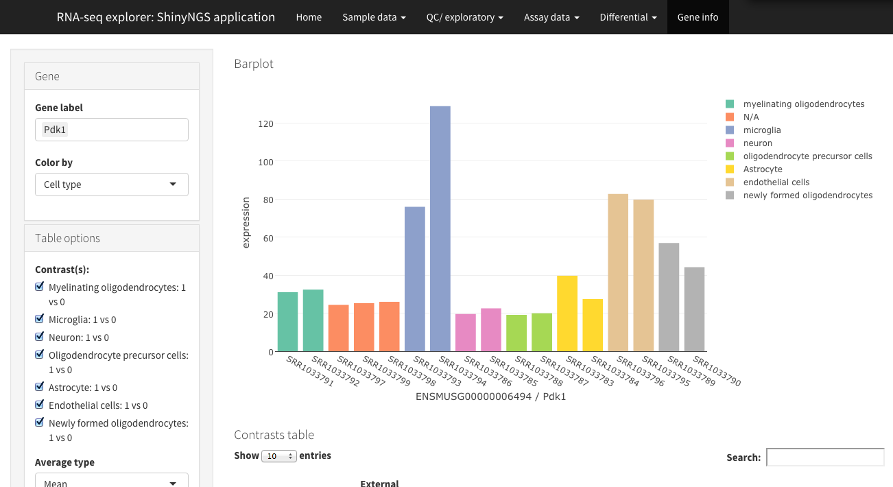

---
output:
  md_document:
    variant: markdown_github
---

<!-- README.md is generated from README.Rmd. Please edit that file -->

```{r, echo = FALSE}
knitr::opts_chunk$set(
  collapse = TRUE,
  comment = "#>",
  fig.path = "README-"
)
```


# Synopsis

Shinyngs is an R package designed to facilitate downstream analysis of RNA-seq and similar expression data with various exploratory plots and data mining tools. It is unrelated to the recently published [Shiny Transcritome Analysis Resource Tool](https://github.com/jminnier/STARTapp) (START), though it was probably developed at the same time as that work.

# Rationale

Shinyngs differs to START and other similar applications (see also [Degust](http://www.vicbioinformatics.com/degust/)), in that no effort is made to provide analysis capabilities. The envisaged process is:

* RNA-seq data is analysed, producing a set of matrices, and p/q values generated for a given set of comparisons.
* Matrix and comparison data is loaded into the modified [SummarizedExperiment](http://bioconductor.org/packages/release/bioc/html/SummarizedExperiment.html) structure provided by Shinyngs, and serialised. This is easily automated.
* Serialised object used as input to autmoatically produce the Shiny app using Shinyngs.

There are a great many experimental designs and analysis methods, and in building Shinyngs I've taken the view that analysis is best left to the analyst. The envisaged use case is that of a bioinformatician attempting to convey results of analysis to non-experts.

ShinyNGS provides a number of capabilities you may not find in other applications:

* Simple selection of gene sets by name/ annotation to modify the plots and tables shown.
* Progressive filters for differential analysis: "Show me all genes differential in these contrasts but NOT in these other contrasts"
* Large variety of visualisations: row-wise clustering, UpSet-style intersection plots, gene set enrichment barcode plots etc.

# Screenshot



## Objectives

* Allow rapid exploration of data output more or less straight from RNA-seq piplelines etc. 
* Where more parameters are provided, extend the exploratory tools available - e.g. for differential expression.

## Features

* A variety of single and multiple-panel Shiny applications- currently heatmap, pca, boxplot, dendrogram, gene-wise barplot, various tables and an RNA-seq app combining all of these.
* Leveraging of libraries such as [DataTables](https://rstudio.github.io/DT/) and [Plotly](https://plot.ly/) for rich interactivity.
* Takes input in an extension of the commonly used `SummarizedExperiment` format, called `ExploratorySummarizedExperiment` 
* Interface kept simple where possible, with complexity automatically added where required:
    * Input field clutter reduced with the use of collapses from [shinyBS](https://ebailey78.github.io/shinyBS/index.html) (when installed).
    * If a list of `ExploratorySummarizedExperiment`s is supplied (useful in situiations where the features are different beween matrices - e.g. from transcript- and gene- level analyses), a selection field will be provided.
    * If a selected experiment contains more than one assay, a selector will again be provided.
* For me: leveraging of [Shiny modules](http://shiny.rstudio.com/articles/modules.html). This makes re-using complex UI components much easier, and maintaining application code is orders of magnitude simpler as a result.

# Modularisation

Shinyngs is built on Shiny 'modules'- most of which are in single files in the package code. As a consequence code is highly re-usable. Documentation forthcoming, but take a look at how the `selectmatrix` module is called by the PCA plots, boxplots etc. 

# Installation

## Prerequisites

`shinyngs` relies heavily on `SummarizedExperiment`. Formerly found in the `GenomicRanges` package, it now has its own package on Bioconductor: http://bioconductor.org/packages/release/bioc/html/SummarizedExperiment.html. This requires a recent version of R. 

Graphical enhancements are provided by `shinyBS` and `shinyjs`

### Browser

**Strong recommendation for Chrome over Firefox** - everything renders much more nicely.

## Install with devtools

```{r eval=FALSE}
devtools::install_github('pinin4fjords/shinyngs', upgrade_dependencies = FALSE)
```

# Example

An example `ExploratorySummarizedExperimentList` based on the Zhang et al study of neurons and glia (http://www.jneurosci.org/content/34/36/11929.long) is included in the package, and this can be used to demonstrate available features.

```{r eval=FALSE}
library(shinyngs)
data("zhangneurons")

app <- prepareApp("rnaseq", zhangneurons)
shiny::shinyApp(app$ui, app$server)
```

The function `eselistFromYAML()` is provided to help build your own objects given a config file. 

# Documentation

Technical information can be accessed via the package documentation:

```{r eval = FALSE}
?shinyngs
```

More user-oriented documentation and examples of how to build your own apps in the [vignette](http://htmlpreview.github.io/?https://github.com/pinin4fjords/shinyngs/blob/master/inst/doc/shinyngs.html). 

This is also accessible via the `vignette` command:

```{r eval = FALSE}
vignette('shinyngs')
```

# TODO

* More useful non-RNAseq functionality to be added 

# Contributors

I can be reached on @pinin4fjords with any queries. Other contributors welcome.

# License

[GNU Affero General Public License v3.0](LICENSE.txt)