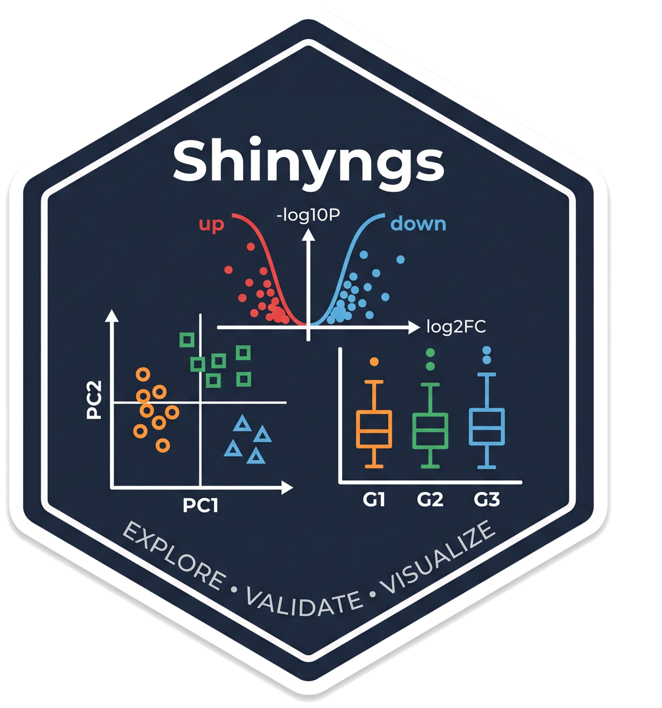

<!-- README.md is generated from README.Rmd. Please edit that file -->

# shinyngs 

# Synopsis

Shinyngs is an R package designed to facilitate downstream analysis of
RNA-seq and similar expression data with various exploratory plots and
data mining tools. It is unrelated to the recently published [Shiny
Transcritome Analysis Resource
Tool](https://github.com/jminnier/STARTapp) (START), though it was
probably developed at the same time as that work.

Full documentation and function reference:
<https://pinin4fjords.github.io/shinyngs/>

# Examples

## Data structure

A companion R package,
[zhangneurons](https://github.com/pinin4fjords/zhangneurons), contains
an example dataset to illustrate the features of Shinyngs, as well as
the code required to produce it.

## Running application

A Shinyngs example is running at
<https://pinin4fjords.shinyapps.io/shinyngs_example/> and contains a
subset of the example data (due to limited resources on shinyapps.io).

# Rationale

Shinyngs differs to START and other similar applications (see also
[Degust](http://www.vicbioinformatics.com/degust/)), in that no effort
is made to provide analysis capabilities. The envisaged process is:

- RNA-seq data is analysed, producing a set of matrices, and p/q values
  generated for a given set of comparisons.
- Matrix and comparison data is loaded into the modified
  [SummarizedExperiment](http://bioconductor.org/packages/release/bioc/html/SummarizedExperiment.html)
  structure provided by Shinyngs, and serialised. This is easily
  automated.
- Serialised object used as input to autmoatically produce the Shiny app
  using Shinyngs.

There are a great many experimental designs and analysis methods, and in
building Shinyngs I’ve taken the view that analysis is best left to the
analyst. The envisaged use case is that of a bioinformatician attempting
to convey results of analysis to non-experts.

ShinyNGS provides a number of capabilities you may not find in other
applications:

- Simple selection of gene sets by name/ annotation to modify the plots
  and tables shown.
- Progressive filters for differential analysis: “Show me all genes
  differential in these contrasts but NOT in these other contrasts”
- Large variety of visualisations: row-wise clustering, UpSet-style
  intersection plots, gene set enrichment barcode plots etc.
- An interactive [igv.js](https://github.com/igvteam/igv.js)-powered
  gene model view in the gene page, showing exon/transcript structure
  alongside expression, when feature metadata includes genomic
  coordinates and an Ensembl species is configured (see
  `--ensembl_species` below).
- A “Share view” button that captures the current selections in the page
  URL, so a configured view can be bookmarked or shared with a link.

# Screenshot


## Objectives

- Allow rapid exploration of data output more or less straight from
  RNA-seq piplelines etc.
- Where more parameters are provided, extend the exploratory tools
  available - e.g. for differential expression.

## Features

- A variety of single and multiple-panel Shiny applications- currently
  heatmap, pca, boxplot, dendrogram, gene-wise barplot, various tables
  and an RNA-seq app combining all of these.
- Leveraging of libraries such as
  [DataTables](https://rstudio.github.io/DT/) and
  [Plotly](https://plot.ly/) for rich interactivity.
- Takes input in an extension of the commonly used
  `SummarizedExperiment` format, called
  `ExploratorySummarizedExperiment`
- Interface kept simple where possible, with complexity automatically
  added where required:
  - Input field clutter reduced with the use of collapses from
    [shinyBS](https://ebailey78.github.io/shinyBS/index.html) (when
    installed).
  - If a list of `ExploratorySummarizedExperiment`s is supplied (useful
    in situiations where the features are different beween matrices -
    e.g. from transcript- and gene- level analyses), a selection field
    will be provided.
  - If a selected experiment contains more than one assay, a selector
    will again be provided.
- For me: leveraging of [Shiny
  modules](http://shiny.rstudio.com/articles/modules.html). This makes
  re-using complex UI components much easier, and maintaining
  application code is orders of magnitude simpler as a result.

# Modularisation

Shinyngs is built on Shiny ‘modules’- most of which are in single files
in the package code. As a consequence code is highly re-usable.
Documentation forthcoming, but take a look at how the `selectmatrix`
module is called by the PCA plots, boxplots etc.

# Installation

## Prerequisites

`shinyngs` relies heavily on `SummarizedExperiment`. Formerly found in
the `GenomicRanges` package, it now has its own package on Bioconductor:
<http://bioconductor.org/packages/release/bioc/html/SummarizedExperiment.html>.
This requires a recent version of R.

Graphical enhancements are provided by `shinyBS` and `shinyjs`

### Browser

**Strong recommendation for Chrome over Firefox** - everything renders
much more nicely.

## Conda

shinyngs is available as a Conda packge in Bioconda, as always it’s
recommended to use a clean environment. With the Bioconda channel
[appropriately configured](https://bioconda.github.io/#usage) you can
just do:

``` bash
conda create -n shinyngs r-shinyngs
conda activate shinyngs
```

(though I always recommend the `mamba` command in place of `conda`).

### Note on M1 Macs

At the time of writing the dependency tree for `arm64` was a bit
problematic. So just make and use Conda envs specifiying intel
architecture:

``` bash
CONDA_SUBDIR=osx-64 conda create -n shinyngs r-shinyngs
conda activate shinyngs
conda config --env --set subdir osx-64
```

## Docker container

Through the magic of the Bioconda and Biocontainers teams there is also
a [Docker image](https://quay.io/repository/biocontainers/r-shinyngs)
available.

## Development version from GitHub

The Conda package above is the recommended, supported way to install
`shinyngs`. To track development instead, install directly from GitHub
with `devtools`:

``` r
devtools::install_github('pinin4fjords/shinyngs')
```

# Example

An example `ExploratorySummarizedExperimentList` based on the Zhang et
al study of neurons and glia
(<http://www.jneurosci.org/content/34/36/11929.long>) is available in a
separate package, and this can be used to demonstrate available
features.

Install the package like:

``` r
library(devtools)
install_github('pinin4fjords/zhangneurons')
```

… and load and use the data like:

``` r
library(shinyngs)
library(zhangneurons)
data("zhangneurons")

app <- prepareApp("rnaseq", zhangneurons)
shiny::shinyApp(app$ui, app$server)
```

The function `eselistFromYAML()` is provided to help build your own
objects given a config file.

# New: command-line interfaces

## App creation

A new feature (may be buggy) is the creation of Shiny apps from file
complements:

    make_app_from_files.R \
        --assay_files raw.tsv,normalised_counts.tsv \
        --sample_metadata samplesheet.csv \
        --feature_metadata gene_meta.tsv \
        --contrast_file contrasts.csv \
        --differential_results treatment-saline-drug.deseq2.results.tsv \
        --output_dir app \
        --contrast_stats_assay 2 \
        --fold_change_scale log2

(This script can be found under `exec`).

This is designed to take a regular file complement of

- Expression matrices
- Metadata (samples and features)
- Contrasts (which sample groups to compare)
- Differential resutls (e.g. from DESeq2) containing P values and fold
  changes

.. and produce an app.R. Gene set enrichment results (GSEA, ROAST, or
other tools via a custom column mapping) can also be wired in via
`--enrichment_gene_sets` and `--enrichment_filename_template` - see
[“Building an app from files with enrichment
results”](https://pinin4fjords.github.io/shinyngs/articles/shinyngs.html#building-an-app-from-files-with-enrichment-results)
in the vignette for a worked example.

If `--feature_metadata` includes `chromosome_name`, `start_position` and
`end_position` columns, passing `--ensembl_species` (e.g. `hsapiens`,
`mmusculus`) enables the gene model view described above.

You can start the resulting app locally, by running the `app.R`
resulting from the above command.

Or run it via Docker: the
[image](https://quay.io/repository/biocontainers/r-shinyngs)
mentioned above already has `shinyngs` and Shiny installed, so it can
run the generated `app.R`/`data.rds` directly - pick a tag from the
[image's tag list](https://quay.io/repository/biocontainers/r-shinyngs?tab=tags)
and mount the directory containing them:

``` bash
docker run --rm -p 3838:3838 \
    -v "$(pwd)/app":/data -w /data \
    quay.io/biocontainers/r-shinyngs:<tag> \
    Rscript -e "shiny::runApp('/data', host = '0.0.0.0', port = 3838)"
```

Then browse to <http://localhost:3838>. `host = '0.0.0.0'` is required
for the app to be reachable from outside the container, and `-w /data`
ensures the app's working directory (and anything it writes) lands in
the mounted directory rather than the container's own filesystem.

See `make_app_from_files.R --help` for more info.

### shinyapps.io deployment

The following specified to `make_app_from_files.R` in addition to the
above will trigger a deployment to shinyapps.io where the app can be
viewed:

        --deploy_app \
        --shinyapps_account ACCOUNT \
        --shinyapps_name APP_NAME

You must derive your token and secret from your shinyapps.io account and
set them in the environment variables `SHINYAPPS_TOKEN` and
`SHINYAPPS_SECRET`, respectively.

This is currently dependent on shinyngs having been installed via
devtools, which doesn’t happen in the Conda install, but I’m trying to
address that.

## Static plot generation

I’ve found it useful to reuse some of the plotting components in
shinyngs to produce non-Shiny plot outputs for use in static reporting.

### Exploratory analysis

A generic complement of explortory plots can be generated like:

    exploratory_plots.R \
        --assay_files salmon.merged.gene_counts.tsv,normalised_counts.tsv,variance_stabilised_counts.tsv \
        --assay_names raw,normalised,variance_stabilised \
        --sample_metadata samplesheet.csv \
        --contrast_variable treatment \
        --outdir plots \
        --feature_metadata gene_meta.tsv

See `exploratory_plots.R  --help` for more info.

### Differential analysis

Differential analysis plots, currently just volcano plots, can be
generated with `differential_plots.R`. See `exploratory_plots.R  --help`
for more info.

### Validation

shinyngs has some good validation when building objects, to make sure
that matrices are consistent with sample and feature annotations, and
that the specified contrasts make sense. Accessing that logic by itself
can be useful when writing FOM (feature/ observation matrix) workflows,
so that is available separately like:

    validate_fom_components.R \
        --sample_metadata=testdata/samplesheet.csv \
        --assay_files=testdata/SRP254919.salmon.merged.gene_counts.top1000cov.tsv \
        --contrasts_file testdata/contrasts.csv \
        --output_directory output

If `--output_directory` is specified, results are re-written (in a
consistent format, TSV by default) the specified location.

This script will error if there are inconsistencies between sample
sheets, feature sets, matrices, and contrast specifications.

# Documentation

Technical information can be accessed via the package documentation:

``` r
?shinyngs
```

More user-oriented documentation and examples of how to build your own
apps in the
[vignette](https://pinin4fjords.github.io/shinyngs/articles/shinyngs.html).

This is also accessible via the `vignette` command:

``` r
vignette('shinyngs')
```

# TODO

- More useful non-RNAseq functionality to be added

# Credits

Shinyngs combines a number of other open-source packages to do its work.
Deployed apps also carry a “Credits” link in the navbar crediting these
directly, but for reference:

- [Shiny](https://shiny.posit.co/) (Winston Chang, Joe Cheng, JJ
  Allaire, Carson Sievert et al., Posit Software) and
  [bslib](https://rstudio.github.io/bslib/) (Carson Sievert, Joe Cheng,
  Garrick Aden-Buie) - the application framework and Bootstrap 5
  theming.
- [DT](https://rstudio.github.io/DT/) (Yihui Xie, Joe Cheng, Xianying
  Tan, Garrick Aden-Buie), wrapping the
  [DataTables](https://datatables.net/) jQuery plugin (SpryMedia Ltd) -
  interactive tables.
- [plotly](https://plotly.com/r/) (Carson Sievert, Chris Parmer, Toby
  Hocking, Scott Chamberlain, Karthik Ram, Marianne Corvellec, Pedro
  Despouy), wrapping [plotly.js](https://plotly.com/javascript/) (Plotly
  Technologies Inc.) - interactive plots.
- [heatmaply](https://talgalili.github.io/heatmaply/) (Tal Galili, Alan
  O’Callaghan) - interactive heatmaps.
- [ggplot2](https://ggplot2.tidyverse.org/) (Hadley Wickham et al.) and
  [ggdendro](https://cran.r-project.org/package=ggdendro) (Andrie de
  Vries) - static plotting.
- [igvShiny](https://github.com/gladkia/igvShiny) (Paul Shannon,
  Arkadiusz Gladki, Karolina Ścigocka), wrapping the [Integrative
  Genomics Viewer](https://igv.org/) (igv.js, Broad Institute) - the
  gene model browser.
- [SummarizedExperiment](https://bioconductor.org/packages/SummarizedExperiment/)
  (Martin Morgan, Valerie Obenchain, Jim Hester, Hervé Pagès),
  [limma](https://bioconductor.org/packages/limma/) (Gordon Smyth et
  al.) and [DEXSeq](https://bioconductor.org/packages/DEXSeq/) (Simon
  Anders, Alejandro Reyes) from Bioconductor.

The full dependency list, with versions, is in
[DESCRIPTION](DESCRIPTION).

# Contributors

I can be reached on @pinin4fjords with any queries. Other contributors
welcome.

# License

[GNU Affero General Public License v3.0](LICENSE.md)
