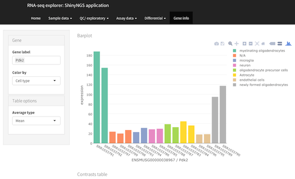
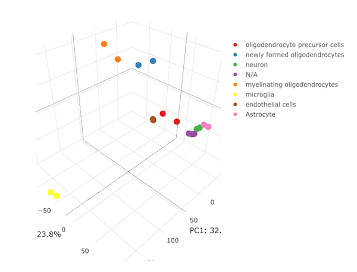

# Interactive downstream analysis with ShinyNGS

## Intro

*[shinyngs](https://github.com/pinin4fjords/shinyngs)* is a package
designed to facilitate downstream analysis of RNA-seq and similar matrix
data with various exploratory plots. It’s a work in progress, with new
features added on a regular basis. Individual components (heatmaps, pca
etc) can function independently and will be useful outside of the
RNA-seq context.



Example: the gene page

## Motivation

It’s not always trivial to quickly assess the results of next-generation
sequencing experiment.
*[shinyngs](https://github.com/pinin4fjords/shinyngs)* is designed to
help fix that by providing a way of instantly producing a visual tool
for data mining at the end of an analysis pipeline.

## Features

- A variety of single and multiple-panel Shiny applications- currently
  heatmap, pca, boxplot, dendrogram, gene-wise barplot, various tables
  and an RNA-seq app combining all of these.
- Leveraging of libraries such as
  [DataTables](https://rstudio.github.io/DT/) and
  [Plotly](https://plot.ly/) for rich interactivity.
- Takes input in an extension of the commonly used
  `SummarizedExperiment` format, called
  `ExploratorySummarizedExperiment`
- Interface kept simple where possible, with complexity automatically
  added where required:
  - Input field clutter reduced with the use of collapses from
    [shinyBS](https://ebailey78.github.io/shinyBS/index.html) (when
    installed).
  - If a list of `ExploratorySummarizedExperiment`s is supplied (useful
    in situations where the features are different beween matrices -
    e.g. from transcript- and gene- level analyses), a selection field
    will be provided.
  - If a selected experiment contains more than one assay, a selector
    will again be provided.
- For me: leveraging of [Shiny
  modules](http://shiny.rstudio.com/articles/modules.md). This makes
  re-using complex UI components much easier, and maintaining
  application code is orders of magnitude simpler as a result.

## Installation

### Prerequisites

`shinyngs` relies heavily on `SumamrizedExperiment`. Formerly found in
the `GenomicRanges` package, it now has its own package on Bioconductor:
[http://bioconductor.org/packages/release/bioc/html/SummarizedExperiment.html](http://bioconductor.org/packages/release/bioc/html/SummarizedExperiment.md).
This requires a recent version of R.

Graphical enhancements are provided by `shinyBS` and `shinyjs`

### Install with devtools

``` r

library(devtools)
install_github('pinin4fjords/shinyngs')
```

## Concepts and data structures

The data structures used by Shinyngs build on `SummarizedExperiment`.
One `SummarizedExperiment` can have multiple ‘assays’, essentially
matrices with samples in columns and ‘features’ (transcripts or genes)
in rows, representing different results for the same features and
samples. This is handy to compare results before and after processing,
for example. `ExploratorySummarizedExperiment` extends
`SummarizedExperiment` to include slots relating to annotation, and
associated results of ‘tests’, providing p values and q values.

`ExploratorySummarizedExperimentList` is a container for one or more
`ExploratorySummarizedExperiment` objects, and is intented to describe
an overall study, i.e. one or more experiments the same set of samples,
but different sets of features in each experiment. The
`ExploratorySummarizedExperimentListList` therefore is used to supply
study-wide things such as contrasts, gene sets, url roots for creating
links etc.

## Simple example working from a SummarizedExperiment

To see how to quickly build an RNA-seq app from a simple
SummarizedExperiment, we can use the example data in the `airway`
package. We just convert the RangedSummarizedExperiment to an
ExploratorySummarizedExperiment, and add it to a list of such objects,
which represent a study.

``` r

library(shinyngs)

data(airway, package = 'airway')
ese <- as(airway, 'ExploratorySummarizedExperiment')
eselist <- ExploratorySummarizedExperimentList(ese)
```

Then we build and run the app. For example, a basic app just for
heatmaps:

``` r

app <- prepareApp('heatmap', eselist)
shiny::shinyApp(ui = app$ui, server = app$server)
```

Note the use of `prepareApp` to generate the proper `ui` and `server`,
which are then passed to Shiny.

We can build a more comprehensive app with multiple panels aimed at
RNA-seq:

``` r

app <- prepareApp('rnaseq', eselist)
shiny::shinyApp(ui = app$ui, server = app$server)
```

Airway provides some info about the dataset, which we can add in to the
object before we build the app:

``` r

data(airway, package = 'airway')
expinfo <- metadata(airway)[[1]]

eselist <- ExploratorySummarizedExperimentList(
  ese,
  title = expinfo@title,
  author = expinfo@name,
  description = abstract(expinfo)
)
app <- prepareApp('rnaseq', eselist)
shiny::shinyApp(ui = app$ui, server = app$server)
```

All this app knows about is gene IDs, however, which aren’t all that
informative for gene expression plots etc. We can add row metadata to
fix that:

``` r

# Use Biomart to retrieve some annotation, and add it to the object

library(biomaRt)
attributes <- c(
  'ensembl_gene_id', # The sort of ID your results are keyed by
  'entrezgene', # Will be used mostly for gene set based stuff
  'external_gene_name' # Used to annotate gene names on the plot
)

mart <- useMart(biomart = 'ENSEMBL_MART_ENSEMBL', dataset = 'hsapiens_gene_ensembl', host='www.ensembl.org')
annotation <- getBM(attributes = attributes, mart = mart)
annotation <- annotation[order(annotation$entrezgene),]

mcols(ese) <- annotation[match(rownames(ese), annotation$ensembl_gene_id),]

# Tell shinyngs what the ids are, and what field to use as a label

ese@idfield <- 'ensembl_gene_id'
ese@labelfield <- 'external_gene_name'

# Re-build the app

eselist <- ExploratorySummarizedExperimentList(
  ese,
  title = expinfo@title,
  author = expinfo@name,
  description = abstract(expinfo)
)
app <- prepareApp('rnaseq', eselist)
shiny::shinyApp(ui = app$ui, server = app$server)
```

## More complex use case: the `zhangneurons` Example dataset

`airway` is fine, but it contains no information on differential
expression. `shinyngs` provides extra slots for differential analyses,
among other things.

An example `ExploratorySummarizedExperimentList` based on the Zhang et
al study of neurons and glia
(<http://www.jneurosci.org/content/34/36/11929.long>) is included in the
`zhangneurons` package, and this can be used to demonstrate available
features. The dataset includes transcript- and gene- level
quantification estimates (as `ExporatorySummarizedExperiment`s within an
`ExploratorySummarizedExperimentList`, and three levels of processing
(raw, filtered, normalised) in the `assays` slots of each.

Note: this data was generated using Salmon
(<https://combine-lab.github.io/salmon/>) for quantification, and
results may therefore be slightly different to the authors’ online tool
(which did not use Salmon).

Install the data package:

``` r

library(devtools)
install_github('pinin4fjords/zhangneurons')
```

… and load the data.

``` r

library(shinyngs)
data("zhangneurons")
```

The data can then be used to build an application:

``` r

app <- prepareApp("rnaseq", zhangneurons)
shiny::shinyApp(app$ui, app$server)
```

This example generates the full application designed for RNA-seq
analysis. Remember that individual components can be created too:

``` r

app <- prepareApp("heatmap", zhangneurons)
shiny::shinyApp(app$ui, app$server)
```

## Building an application from a YAML file

An alternative and simple way to create an application is to describe
your experiment using a YAML file, and pass the YAML file to Shinyngs.
This has advantages where a pipeline produces many outputs outside of R
which then have to be read and compiled.

The
[`eselistFromYAML()`](https://pinin4fjords.github.io/shinyngs/reference/eselistFromYAML.md)
function is provided to help construct an
ExploratorySummarizedExperiment object. You might make a file like:

    title: My RNA seq experiment
    author: Joe Blogs
    report: report.md
    group_vars:
      - Group
      - Replicate
    default_groupvar: Group
    experiments:
      Gene:
        coldata:
          file: my.experiment.csv
          id: External
        annotation:
          file: my.annotation.csv
          id: gene_id
          entrez: ~
          label: gene_id
        expression_matrices:
          Raw:
            file: raw_counts.csv
            measure: counts
          Filtered:
            file: filtered_counts.csv
            measure: Counts per million
          Normalised:
            file: normalised_counts.csv
            measure: Counts per million
        read_reports:
          read_attrition: read_attrition.csv
    contrasts:
      comparisons:
        0:
        - Group
          control
          TreatmentA
        1:
        - Group
          control
          TreatmentB
    stats:
      Gene:
        Normalised:
          pvals: pvals.csv
          qvals: qvals.csv

You can then generate the object with a command like
`eselist <- eselistFromYAML('my.yaml')`. This is how the `zhangneurons`
dataset was generated- see `vignette(zhangneurons)` for details, and for
the component input files themselves.

## Building an application from scratch

To demonstrate this, let’s break down `zhangneurons` into simple
datatypes and put it back together again.

### Assays

``` r

# Assays is a list of matrices
library(zhangneurons)
data(zhangneurons, envir = environment())
myassays <- as.list(SummarizedExperiment::assays(zhangneurons[[1]]))
```

    ## Loading required package: shinyngs

    ## Loading required package: SummarizedExperiment

    ## Loading required package: MatrixGenerics

    ## Loading required package: matrixStats

    ## 
    ## Attaching package: 'MatrixGenerics'

    ## The following objects are masked from 'package:matrixStats':
    ## 
    ##     colAlls, colAnyNAs, colAnys, colAvgsPerRowSet, colCollapse,
    ##     colCounts, colCummaxs, colCummins, colCumprods, colCumsums,
    ##     colDiffs, colIQRDiffs, colIQRs, colLogSumExps, colMadDiffs,
    ##     colMads, colMaxs, colMeans2, colMedians, colMins, colOrderStats,
    ##     colProds, colQuantiles, colRanges, colRanks, colSdDiffs, colSds,
    ##     colSums2, colTabulates, colVarDiffs, colVars, colWeightedMads,
    ##     colWeightedMeans, colWeightedMedians, colWeightedSds,
    ##     colWeightedVars, rowAlls, rowAnyNAs, rowAnys, rowAvgsPerColSet,
    ##     rowCollapse, rowCounts, rowCummaxs, rowCummins, rowCumprods,
    ##     rowCumsums, rowDiffs, rowIQRDiffs, rowIQRs, rowLogSumExps,
    ##     rowMadDiffs, rowMads, rowMaxs, rowMeans2, rowMedians, rowMins,
    ##     rowOrderStats, rowProds, rowQuantiles, rowRanges, rowRanks,
    ##     rowSdDiffs, rowSds, rowSums2, rowTabulates, rowVarDiffs, rowVars,
    ##     rowWeightedMads, rowWeightedMeans, rowWeightedMedians,
    ##     rowWeightedSds, rowWeightedVars

    ## Loading required package: GenomicRanges

    ## Loading required package: stats4

    ## Loading required package: BiocGenerics

    ## 
    ## Attaching package: 'BiocGenerics'

    ## The following objects are masked from 'package:stats':
    ## 
    ##     IQR, mad, sd, var, xtabs

    ## The following objects are masked from 'package:base':
    ## 
    ##     anyDuplicated, aperm, append, as.data.frame, basename, cbind,
    ##     colnames, dirname, do.call, duplicated, eval, evalq, Filter, Find,
    ##     get, grep, grepl, intersect, is.unsorted, lapply, Map, mapply,
    ##     match, mget, order, paste, pmax, pmax.int, pmin, pmin.int,
    ##     Position, rank, rbind, Reduce, rownames, sapply, saveRDS, setdiff,
    ##     table, tapply, union, unique, unsplit, which.max, which.min

    ## Loading required package: S4Vectors

    ## 
    ## Attaching package: 'S4Vectors'

    ## The following object is masked from 'package:utils':
    ## 
    ##     findMatches

    ## The following objects are masked from 'package:base':
    ## 
    ##     expand.grid, I, unname

    ## Loading required package: IRanges

    ## Loading required package: GenomeInfoDb

    ## Loading required package: Biobase

    ## Welcome to Bioconductor
    ## 
    ##     Vignettes contain introductory material; view with
    ##     'browseVignettes()'. To cite Bioconductor, see
    ##     'citation("Biobase")', and for packages 'citation("pkgname")'.

    ## 
    ## Attaching package: 'Biobase'

    ## The following object is masked from 'package:MatrixGenerics':
    ## 
    ##     rowMedians

    ## The following objects are masked from 'package:matrixStats':
    ## 
    ##     anyMissing, rowMedians

    ## 
    ## Attaching package: 'shinyngs'

    ## The following object is masked from 'package:MatrixGenerics':
    ## 
    ##     colMedians

    ## The following object is masked from 'package:matrixStats':
    ## 
    ##     colMedians

``` r

head(myassays[[1]])
```

    ##                    Astrocyte1 Astrocyte2 Neuron1 Neuron2  OPC1  OPC2   NFO1
    ## ENSMUSG00000000001      81.36      93.35   58.59   82.92 77.56 57.51 107.30
    ## ENSMUSG00000000028       6.19       6.08    1.90    1.75  8.47 14.66   2.86
    ## ENSMUSG00000000031       2.67       8.56    1.92    0.46  1.27  1.29   0.43
    ## ENSMUSG00000000037       5.54      12.45    6.51    4.02 13.37  6.49   3.24
    ## ENSMUSG00000000049       0.00       0.05    0.13    0.12  0.05  0.00   0.14
    ## ENSMUSG00000000056      27.55      21.67   34.60   29.68 24.78 20.36  44.82
    ##                     NFO2   MO1   MO2 Microglia1 Microglia2 Endothelial1
    ## ENSMUSG00000000001 69.97 69.86 62.43      63.40      40.07       184.40
    ## ENSMUSG00000000028  2.67  3.72  1.87       3.77       0.49        11.81
    ## ENSMUSG00000000031  0.43  0.26  0.23       1.29       0.94         3.58
    ## ENSMUSG00000000037  1.18  0.34  0.91       2.43       0.00         1.34
    ## ENSMUSG00000000049  0.00  0.07  0.12       0.00       0.00         0.04
    ## ENSMUSG00000000056 41.08 75.28 67.80      49.19      35.42        44.85
    ##                    Endothelial2   WC1   WC2   WC3
    ## ENSMUSG00000000001       163.79 90.48 76.10 81.63
    ## ENSMUSG00000000028        13.49  5.63  5.48  7.51
    ## ENSMUSG00000000031         5.61  6.64  5.85  6.90
    ## ENSMUSG00000000037         0.84  5.56  5.77  6.41
    ## ENSMUSG00000000049         0.00  0.03  0.00  0.03
    ## ENSMUSG00000000056        47.95 33.69 38.41 33.54

### colData

colData is your sample information defining groups etc

``` r

mycoldata <- data.frame(SummarizedExperiment::colData(zhangneurons[[1]]))
head(mycoldata)
```

    ##             Internal   External Astrocyte Neuron OPC NFO MO Microglia
    ## Astrocyte1 SRS504825 Astrocyte1       yes     no  no  no no        no
    ## Astrocyte2 SRS504826 Astrocyte2       yes     no  no  no no        no
    ## Neuron1    SRS504827    Neuron1        no    yes  no  no no        no
    ## Neuron2    SRS504828    Neuron2        no    yes  no  no no        no
    ## OPC1       SRS504829       OPC1        no     no yes  no no        no
    ## OPC2       SRS504830       OPC2        no     no yes  no no        no
    ##            Endothelial WC     Group          Tissue
    ## Astrocyte1          no no Astrocyte cerebral_cortex
    ## Astrocyte2          no no Astrocyte cerebral_cortex
    ## Neuron1             no no    Neuron cerebral_cortex
    ## Neuron2             no no    Neuron cerebral_cortex
    ## OPC1                no no       OPC cerebral_cortex
    ## OPC2                no no       OPC cerebral_cortex

### Annotation

Annotation is important to \`shinyngs’. You need a data frame with rows
corresonding to those in the assays

``` r

myannotation <- SummarizedExperiment::mcols(zhangneurons[[1]])
head(myannotation)
```

    ## DataFrame with 6 rows and 6 columns
    ##                               gene_id         source gene_version   gene_name
    ##                           <character>    <character>  <character> <character>
    ## ENSMUSG00000000001 ENSMUSG00000000001 ensembl_havana            4       Gnai3
    ## ENSMUSG00000000028 ENSMUSG00000000028 ensembl_havana           14       Cdc45
    ## ENSMUSG00000000031 ENSMUSG00000000031 ensembl_havana           15         H19
    ## ENSMUSG00000000037 ENSMUSG00000000037 ensembl_havana           16       Scml2
    ## ENSMUSG00000000049 ENSMUSG00000000049 ensembl_havana           11        Apoh
    ## ENSMUSG00000000056 ENSMUSG00000000056 ensembl_havana            7        Narf
    ##                      gene_biotype       phase
    ##                       <character> <character>
    ## ENSMUSG00000000001 protein_coding          NA
    ## ENSMUSG00000000028 protein_coding          NA
    ## ENSMUSG00000000031        lincRNA          NA
    ## ENSMUSG00000000037 protein_coding          NA
    ## ENSMUSG00000000049 protein_coding          NA
    ## ENSMUSG00000000056 protein_coding          NA

### Making an `ExploratorySummarizedExperiment`

Now we can put these things together to create an
’ExploratorySummarizedExperiment:

``` r

library(shinyngs)
myese <- ExploratorySummarizedExperiment(
    assays = SimpleList(
      myassays
    ),
    colData = DataFrame(mycoldata),
    annotation <- myannotation,
    idfield = 'gene_id',
    labelfield = "gene_name"
  )
print(myese)
```

    ## class: ExploratorySummarizedExperiment 
    ## dim: 45294 17 
    ## metadata(0):
    ## assays(4): Filtered normalised Unfiltered normalised Filtered
    ##   Unfiltered
    ## rownames(45294): ENSMUSG00000000001 ENSMUSG00000000028 ...
    ##   ENSMUSG00000109577 ENSMUSG00000109578
    ## rowData names(6): gene_id source ... gene_biotype phase
    ## colnames(17): Astrocyte1 Astrocyte2 ... WC2 WC3
    ## colData names(12): Internal External ... Group Tissue

Note the extra fields that mostly tell `shinyngs` about annotation to
help with labelling etc.

### Making an `ExploratorySummarizedExperimentList`

`ExploratorySummarizedExperimentList`s are basically a list of
`ExploratorySummarizedExperiment`s, with additional metadata slots.

``` r

myesel <- ExploratorySummarizedExperimentList(
  eses = list(expression = myese),
  title = "My title",
  author = "My Authors",
  description = 'Look what I gone done'
)
```

    ## [1] "Creating ExploratorySummarizedExperimentList object"

You can use this object to make an app straight away:

``` r

app <- prepareApp("rnaseq", myesel)
shiny::shinyApp(app$ui, app$server)
```

… but it’s of limited usefulness because the sample groupings are not
highlighted. We need to specify `group_vars` for that to happen, picking
column names from the `colData`:

``` r

myesel@group_vars <- c('Group', 'Tissue')
```

.. then if we re-make the app you should see group highlighting.

``` r

app <- prepareApp("rnaseq", myesel)
shiny::shinyApp(app$ui, app$server)
```

… for example, in the PCA plot



Example: the gene page

### Specifying contrasts for differential outputs

But where are the extra plots for looking at differential expression?
For those, we need to supply contrasts. Contrasts are supplied as a list
of character vectors describing the variable in `colData` upon the
contrast is based, and the two values of that variable to use in the
comparison. We’ll just copy the one over from the original
`zhangneurons`:

``` r

zhangneurons@contrasts
```

    ## $`0`
    ## [1] "Astrocyte" "no"        "yes"      
    ## 
    ## $`1`
    ## [1] "Neuron" "no"     "yes"   
    ## 
    ## $`2`
    ## [1] "OPC" "no"  "yes"
    ## 
    ## $`3`
    ## [1] "NFO" "no"  "yes"
    ## 
    ## $`4`
    ## [1] "MO"  "no"  "yes"
    ## 
    ## $`5`
    ## [1] "Microglia" "no"        "yes"      
    ## 
    ## $`6`
    ## [1] "Endothelial" "no"          "yes"        
    ## 
    ## $`7`
    ## [1] "WC"  "no"  "yes"

``` r

myesel@contrasts <- zhangneurons@contrasts
```

Run the app again and you should see tables of differential expression,
and scatter plots between pairs of conditions.

``` r

app <- prepareApp("rnaseq", myesel)
shiny::shinyApp(app$ui, app$server)
```

But without information on the significance of the fold changes, we
can’t make things like volcano plots. For those we need to populate the
`contrast_stats` slot. contrast_stats is a list of lists of matrices in
the `ExploratorySummarizedExperiment` objects, with list names matching
one or more of the names in `assays`, second-level names being ‘pvals’
and ‘qvals’ and the columns of each matrix corresponding the the
`contrasts` slot of the containing
`ExploratorySummarizedExperimentList`:

``` r

head(zhangneurons[[1]]@contrast_stats[[1]]$pvals, n = 10)
```

    ##                             V2         V3         V4         V5          V6
    ## ENSMUSG00000000001 0.954431381 0.52147727 0.43574987 0.91618099 0.382451244
    ## ENSMUSG00000000028 0.914714978 0.07287955 0.12323387 0.23224803 0.234844305
    ## ENSMUSG00000000031 0.270039596 0.30775045 0.34745593 0.05009022 0.016689453
    ## ENSMUSG00000000037 0.277990289 0.83350132 0.20125550 0.41396914 0.052248656
    ## ENSMUSG00000000049 0.593616803 0.10741614 0.59510659 0.58478266 0.383455060
    ## ENSMUSG00000000056 0.102437202 0.47232933 0.05920835 0.75564050 0.004653788
    ## ENSMUSG00000000058 0.609392261 0.17102381 0.63752895 0.41654501 0.030722983
    ## ENSMUSG00000000078 0.141945850 0.17365133 0.20196946 0.12591044 0.049893259
    ## ENSMUSG00000000085 0.816976216 0.19272012 0.77991512 0.29710357 0.161795584
    ## ENSMUSG00000000088 0.009059623 0.96477540 0.15211473 0.76805602 0.292066004
    ##                            V7           V8         V9
    ## ENSMUSG00000000001 0.09171343 0.0006796002 0.87130628
    ## ENSMUSG00000000028 0.11039497 0.0658679387 0.87024342
    ## ENSMUSG00000000031 0.27735521 0.4636852879 0.06015139
    ## ENSMUSG00000000037 0.16137641 0.1334435621 0.62878553
    ## ENSMUSG00000000049 0.11474475 0.4398216660 0.27476860
    ## ENSMUSG00000000056 0.78948071 0.5307721742 0.61044766
    ## ENSMUSG00000000058 0.00979094 0.0014196904 0.63315044
    ## ENSMUSG00000000078 0.92278271 0.0091160229 0.29632487
    ## ENSMUSG00000000085 0.26399034 0.5824472718 0.52928034
    ## ENSMUSG00000000088 0.82786995 0.0527881219 0.66241873

Again, we’ll just copy those data from `zhangneurons` for demonstration
purposes:

``` r

myesel[[1]]@contrast_stats <- zhangneurons[[1]]@contrast_stats
```

Now the RNA-seq app is more or less complete, and you should see volcano
plots under ‘Differential’:

``` r

app <- prepareApp("rnaseq", myesel)
shiny::shinyApp(app$ui, app$server)
```

## Gene sets

Many displays are more useful if they can be limited to biologically
meaningful sets of genes. The `gene_sets` slot is designed to allow
that. Gene sets are stored as lists of character vectors of gene
identifiers, each list keyed by the name of the metadata column to which
they pertain.

### Adding gene sets to enable gene set filtering

The constructor for `ExploratorySummarizedExperimentList` assumes that
gene sets are represented by the ID type specified in the
`gene_set_id_type_slot`, and that they are specified as a list of
`GeneSetCollection`s. You might generate such a list as follows:

``` r

genesets_files <- list(
  'KEGG' =  "/path/to/MSigDB/c2.cp.kegg.v5.0.entrez.gmt",
  'MSigDB canonical pathway' = "/path/to/MSigDB/c2.cp.v5.0.entrez.gmt",
  'GO biological process' = "/path/to/MSigDB/c5.bp.v5.0.entrez.gmt",
  'GO cellular component' = "/path/to/MSigDB/c5.cc.v5.0.entrez.gmt",
  'GO molecular function' = "/path/to/MSigDB/c5.mf.v5.0.entrez.gmt",
  'MSigDB hallmark'= "/path/to/MSigDB/h.all.v5.0.entrez.gmt"
)

gene_sets <- lapply(genesets_files, GSEABase::getGmt)
```

Then provide them during object creation:

``` r

myesel <- ExploratorySummarizedExperimentList(
  eses = list(expression = myese),
  title = "My title",
  author = "My Authors",
  description = 'Look what I gone done',
  gene_sets = gene_sets
)
```

These are then converted internally to a list of lists of character
vectors of gene IDs. The top level is keyed by the type of gene ID to be
used for labelling (stored in
`labelfield' on`ExploratorySummarisedExperiments\`, the next level by
the type of gene set.

For the `zhangneurons` example, gene sets are stored by `gene_name`:

``` r

names(zhangneurons@gene_sets)
```

    ## [1] "gene_name"

4 types of gene set are used. For example, GO Biological Processes
(GOBP):

``` r

names(zhangneurons@gene_sets$gene_name$GOBP)[1:10]
```

    ##  [1] "GO_REGULATION_OF_DOPAMINE_METABOLIC_PROCESS"                 
    ##  [2] "GO_LACTATE_TRANSPORT"                                        
    ##  [3] "GO_POSITIVE_REGULATION_OF_VIRAL_TRANSCRIPTION"               
    ##  [4] "GO_DETECTION_OF_LIGHT_STIMULUS_INVOLVED_IN_VISUAL_PERCEPTION"
    ##  [5] "GO_CARDIAC_CHAMBER_DEVELOPMENT"                              
    ##  [6] "GO_CALCIUM_ION_TRANSMEMBRANE_IMPORT_INTO_CYTOSOL"            
    ##  [7] "GO_DNA_DEPENDENT_DNA_REPLICATION_MAINTENANCE_OF_FIDELITY"    
    ##  [8] "GO_TRNA_AMINOACYLATION"                                      
    ##  [9] "GO_CIRCADIAN_RHYTHM"                                         
    ## [10] "GO_PHOSPHATIDYLSERINE_ACYL_CHAIN_REMODELING"

We can find the list of GO lactate transport genes, keyed by gene
symbol:

``` r

zhangneurons@gene_sets$gene_name$GOBP$GO_LACTATE_TRANSPORT
```

    ##    Slc16a8    Slc16a5    Slc16a4    Slc5a12        Emb    Slc16a1    Slc16a7 
    ##  "Slc16a8"  "Slc16a5"  "Slc16a4"  "Slc5a12"      "Emb"  "Slc16a1"  "Slc16a7" 
    ##   Slc16a12   Slc16a13    Slc16a6    Slc16a3   Slc16a11 
    ## "Slc16a12" "Slc16a13"  "Slc16a6"  "Slc16a3" "Slc16a11"

Of course if you want to avoid the constructor, you can replicate that
data structure and set the `@gene_sets` directly.

### Gene set analysis

Gene set analyses can be stored as a list of tables in the
`@gene_set_analyses` slot of an `ExploratorySummarizedExperiment`,
supplied via the `gene_set_analyses` argument to its constructor. The
list is keyed at three levels representing the assay, the gene set type
and contrast involved. Illustrated with `zhangneurons` again:

``` r

names(zhangneurons$gene@gene_set_analyses)
```

    ## [1] "Filtered normalised"   "Unfiltered normalised"

``` r

names(zhangneurons$gene@gene_set_analyses$`Filtered normalised`)
```

    ## [1] "CP"   "GOBP" "GOCC" "GOMF"

``` r

names(zhangneurons$gene@gene_set_analyses$`Filtered normalised`$GOBP)
```

    ## [1] "Astrocyte-no-yes"   "Endothelial-no-yes" "MO-no-yes"         
    ## [4] "Microglia-no-yes"   "NFO-no-yes"         "Neuron-no-yes"     
    ## [7] "OPC-no-yes"         "WC-no-yes"

``` r

head(zhangneurons$gene@gene_set_analyses$`Filtered normalised`$GOBP$`MO-no-yes`)
```

    ##                                                        NGenes   PropDown
    ## GO_MITOCHONDRIAL_ELECTRON_TRANSPORT_NADH_TO_UBIQUINONE     38 0.00000000
    ## GO_MITOCHONDRIAL_RESPIRATORY_CHAIN_COMPLEX_I_ASSEMBLY      48 0.02083333
    ## GO_NADH_DEHYDROGENASE_COMPLEX_ASSEMBLY                     48 0.02083333
    ## GO_REGULATION_OF_NUCLEAR_CELL_CYCLE_DNA_REPLICATION        10 0.70000000
    ## GO_OXIDATIVE_PHOSPHORYLATION                               73 0.00000000
    ## GO_DISTAL_TUBULE_DEVELOPMENT                               10 0.60000000
    ##                                                           PropUp Direction
    ## GO_MITOCHONDRIAL_ELECTRON_TRANSPORT_NADH_TO_UBIQUINONE 0.7631579        Up
    ## GO_MITOCHONDRIAL_RESPIRATORY_CHAIN_COMPLEX_I_ASSEMBLY  0.7291667        Up
    ## GO_NADH_DEHYDROGENASE_COMPLEX_ASSEMBLY                 0.7291667        Up
    ## GO_REGULATION_OF_NUCLEAR_CELL_CYCLE_DNA_REPLICATION    0.0000000      Down
    ## GO_OXIDATIVE_PHOSPHORYLATION                           0.6575342        Up
    ## GO_DISTAL_TUBULE_DEVELOPMENT                           0.0000000      Down
    ##                                                        PValue        FDR
    ## GO_MITOCHONDRIAL_ELECTRON_TRANSPORT_NADH_TO_UBIQUINONE  0.001 0.01284807
    ## GO_MITOCHONDRIAL_RESPIRATORY_CHAIN_COMPLEX_I_ASSEMBLY   0.001 0.01284807
    ## GO_NADH_DEHYDROGENASE_COMPLEX_ASSEMBLY                  0.001 0.01284807
    ## GO_REGULATION_OF_NUCLEAR_CELL_CYCLE_DNA_REPLICATION     0.001 0.01284807
    ## GO_OXIDATIVE_PHOSPHORYLATION                            0.001 0.01284807
    ## GO_DISTAL_TUBULE_DEVELOPMENT                            0.001 0.01284807

This data struture is a bit cumbersome, and I’m thinking of ways of
better representing such data and the associated contrasts.

#### Enrichment tool formats and auto-detection

Enrichment tables from different tools use different column names for
the p-value, FDR and direction. `shinyngs` detects the tool from the
table columns, so both `roast`/`mroast` output (`p value`/`PValue`,
`FDR`, `Direction`) and GSEA output (`NOM p-val`, `FDR q-val`) are
filtered on the correct columns without extra configuration. The
optional `gene_set_analyses_tool` slot (nested like `gene_set_analyses`)
can force a particular format; it defaults to `"auto"`.

To support a tool `shinyngs` doesn’t recognise natively, set the
corresponding `gene_set_analyses_tool` entry to a named vector giving
the columns to filter on, instead of a tool name:

``` r

gene_set_analyses_tool <- list(
  "normalised" = list(
    "my_gene_sets" = list(
      "disease_vs_control" = c(pvalue = "PValue", fdr = "adj.P.Val", direction = "dir")
    )
  )
)
```

GSEA reports up- and down-regulated results in two files. Supply these
as a named list per contrast and they are combined, with a `Direction`
column added:

``` r

gene_set_analyses <- list(
  "normalised" = list(
    "my_gene_sets" = list(
      "disease_vs_control" = c(up = "gsea_report_for_disease.tsv", down = "gsea_report_for_control.tsv")
    )
  )
)
```

#### Building an app from files with enrichment results

`exec/make_app_from_files.R` can wire GSEA (or `roast`) results into an
app from the command line. `--enrichment_filename_template` describes
where the result files live, with `{contrast_name}` and `{geneset_type}`
substituted per contrast and gene set type, and an optional
`{target|reference}` token to point at the split up/down GSEA files:

``` sh
make_app_from_files.R \
  ... \
  --contrast_file contrasts.csv \
  --enrichment_gene_sets my_gene_sets.gmt \
  --enrichment_filename_template 'gsea_{contrast_name}_{geneset_type}_for_{target|reference}.tsv'
```

Pass `--enrichment_skip_missing` to tolerate contrasts or gene set types
with no result files; those contrasts simply show “No enrichment results
for this contrast” in the app. For a tool that isn’t auto-detected, give
`--enrichment_pval_column`, `--enrichment_fdr_column` and
`--enrichment_direction_column` to name the columns to filter on.

## Other options

Further options are available - for example supplying `url_roots` in the
`ExploratorySummarizedExperimentList` will add link-outs where
appropriate, and the `description` slot is handy for providing details
of analysis to the user.

## Included modules

`shinyngs` is build on a number of components built using Shiny’s module
framework, many of which are used multiple times in complex applications
such as the one described above for RNA-seq.

Included modules are currently:

- `heatmap` - provides controls and a display for making heat maps based
  on user criteria.
- `pca` - provides controls and display for an interactive PCA plot.
- `boxplot` - provides controls and display for an interactive boxplot.
- `dendro` - a clustering of samples in dendrogram plotted with
  `ggdendro`}.
- `gene` - a bar plot showing gene expression and a table with fold
  changes etc (where appropriate)
- `simpletable` - a simple display using datatables (via the `DT`
  package) to show a table and a download button. More complex table
  displays (with further controls, for example) can build on this
  module.
- `assaydatatable` - shows the `assaydata()` content of the selected
  experiment.
- `selectmatrix` - provides controls and output for subsetting the
  profided assay data prior to plotting. Called by many of the plotting
  modules.
- `sampleselect` - provides a UI element for selecting the columns of
  the matrix based on sample name or group. Called by the `selectmatrix`
  module.
- `geneselect` - provides a UI element for selecing the rows of a matrix
  based on criteria such as variance. Called by the `selectmatrix`
  module.
- `genesets` - provides UI element for selecting gene sets. Called by
  the `geneselect` module when a user chooses to filter by gene set.
- `plotdownload` - provides download button to non-Plotly plots
  (Plotly-driven plots have their own export button)
- … and other smaller modules used for utility functions such as a
  drop-down specifying how various plots should color based on sample
  group.

So for example `heatmap` uses `selectmatrix` to provide the UI controls
to subselect the supplied matrices as well as the code which reads the
output of those controls to actually derive the subsetted matrix. Shiny
modules make this recycling of code much, much simpler than it would be
otherwise.

Many of these can be called individually, for example to make an app for
dendrograms only:

``` r

app <- prepareApp('dendro', eselist)
shiny::shinyApp(ui = app$ui, server = app$server)
```

## Technical information

For technical information on package layout and functions, consult the
package documentation:

``` r

?shinyngs
```

## Running on a shiny server

Just use the commands sets above with `shinyApp()` in a file called
app.R in a directory of its own on your Shiny server. For example, If
you’re created an `ExploratorySummarizedExperiment` and saved it to a
file called ‘data.rds’:

``` r

library(shinyngs)

mydata <- readRDS("data.rds")

app <- prepareApp("rnaseq", mydata)
shiny::shinyApp(app$ui, app$server)
```
