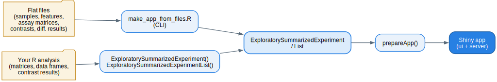

```{r setup, include = FALSE}
knitr::opts_chunk$set(
  collapse = TRUE,
  comment = "#>"
)
library(shinyngs)
suppressPackageStartupMessages(library(SummarizedExperiment))
```

`shinyngs` renders an interactive app from data you have *already* analysed. It
is a viewer, not an analysis engine: it does not compute normalisation,
differential expression or enrichment for you. Your job is to package the
results of your pipeline into the two data structures the app understands. This
article walks through those structures from the ground up, building a small but
complete object you could hand straight to `prepare_app()`.

If you would rather describe your data in files and let `shinyngs` assemble the
object for you, see [Building an app from files and YAML](build-from-files.html).

There are two routes in, both converging on the same pair of container classes:



## The two containers

`shinyngs` defines two S4 classes:

* **`ExploratorySummarizedExperiment`** (ESE) extends Bioconductor's
  `SummarizedExperiment`. Like its parent it holds one or more *assays* (feature
  x sample matrices) plus sample metadata (`colData`) and feature annotation
  (`rowData`/`mcols`). It *adds* slots describing how to label features and where
  to find per-contrast statistics, gene-set analyses and read reports.

* **`ExploratorySummarizedExperimentList`** (ESEList) is a list of one or more
  ESEs sharing the same samples but potentially different feature sets (for
  example a transcript-level and a gene-level quantification of the same
  experiment). It carries study-wide metadata: title, author, the grouping
  variables, the contrasts used for differential testing, gene sets and link-out
  URLs.

The division of labour matters. Anything specific to *one feature set* (the
matrices, their annotation, the differential statistics) lives on the ESE.
Anything that describes the *study as a whole* (contrasts, gene sets, grouping
variables) lives on the ESEList. The same contrast definition on the ESEList is
referenced by the `contrast_stats` on every contained ESE.

## Building an ESE from scratch

We will build a tiny toy dataset: 6 genes across 4 samples (two groups of two
replicates). Everything here is `eval`uated when this page is built, so you can
copy the code and get a working object.

### Assays

An assay is a matrix with features in rows and samples in columns. You can
supply several assays representing different stages of processing of the *same*
features and samples - here a raw count matrix and a normalised (CPM) matrix.
The column names of every assay must match the row names of the `colData`.

```{r assays}
set.seed(1)
genes <- paste0("GENE", 1:6)
samples <- c("ctrl_1", "ctrl_2", "trt_1", "trt_2")

raw_counts <- matrix(
  sample(0:500, 24, replace = TRUE),
  nrow = 6, ncol = 4,
  dimnames = list(genes, samples)
)

normalised <- sweep(raw_counts, 2, colSums(raw_counts), "/") * 1e6

myassays <- list(raw = raw_counts, normalised = round(normalised, 2))
myassays$raw
```

The names you give the list elements (`raw`, `normalised`) are what the app
shows in its assay selector, so choose them for humans.

### colData

`colData` is the sample sheet: one row per sample, columns describing the
experimental design. Its row names identify the samples and must match the
assay column names.

```{r coldata}
mycoldata <- data.frame(
  Group = c("control", "control", "treated", "treated"),
  Replicate = c("1", "2", "1", "2"),
  row.names = samples
)
mycoldata
```

### Annotation

Feature annotation is a data frame with one row per feature. It is important to
`shinyngs`: it supplies the human-readable labels used throughout the app and,
optionally, the genomic coordinates that unlock the gene-model view. The row
names must match the assay row names.

```{r annotation}
myannotation <- data.frame(
  gene_id = genes,
  gene_name = paste0("Symbol", 1:6),
  entrezgene = as.character(1000 + 1:6),
  chromosome_name = "1",
  start_position = seq(1, by = 1000, length.out = 6),
  end_position = seq(500, by = 1000, length.out = 6),
  row.names = genes,
  stringsAsFactors = FALSE
)
myannotation
```

Three annotation columns are singled out by name when you build the object:

* **`idfield`** - the column whose values equal the assay row names (the primary
  identifier, e.g. an Ensembl gene ID).
* **`labelfield`** - the column used for display labels (e.g. a gene symbol).
  This is also the key `shinyngs` uses to relate gene sets to features.
* **`entrezgenefield`** - the column holding Entrez IDs, used for link-outs and
  some gene-set operations. Optional.

Including `chromosome_name`, `start_position` and `end_position` (plus setting
`ensembl_species` on the ESEList, below) enables the interactive igv.js gene
model view in the `gene` module.

### Assembling the ESE

`ExploratorySummarizedExperiment()` ties these together. Note that `assays` is
wrapped in `SimpleList()` and `colData` in `DataFrame()`, exactly as for a plain
`SummarizedExperiment`.

```{r ese}
myese <- ExploratorySummarizedExperiment(
  assays = SimpleList(myassays),
  colData = DataFrame(mycoldata),
  annotation = myannotation,
  idfield = "gene_id",
  labelfield = "gene_name",
  entrezgenefield = "entrezgene"
)
myese
```

The constructor aligns every assay and the annotation to a common set of row
names, coerces annotation to character and rounds assay values to two decimal
places, so minor inconsistencies between inputs are reconciled for you.

## Wrapping in an ESEList

A single ESE is not directly viewable; it must live inside an ESEList, which
supplies the study-level context.

```{r esel}
myesel <- ExploratorySummarizedExperimentList(
  eses = list(expression = myese),
  title = "Toy study",
  author = "A. Bioinformatician",
  description = "A tiny worked example",
  group_vars = c("Group", "Replicate"),
  default_groupvar = "Group"
)
myesel@group_vars
```

At this point you already have a runnable app. Any chunk that launches Shiny is
marked `eval=FALSE` here because a browser session cannot run during page build,
but the code is exactly what you would run interactively:

```{r run-basic, eval = FALSE}
app <- prepare_app("rnaseq", myesel)
shiny::shinyApp(app$ui, app$server)
```

`group_vars` names the `colData` columns a user may colour and group samples by
(in the PCA plot, boxplots and so on). If you omit `group_vars`, the constructor
guesses sensible ones from the `colData`; supplying them explicitly gives you
control over what appears.

## Adding contrasts for differential views

Differential-expression panels (tables, volcano plots, MA plots, fold-change
scatters) appear only when the object describes contrasts. A contrast is a
length-3 character vector: the `colData` variable, the value on the *control*
side, and the value on the *treatment* side. Contrasts live on the ESEList
because they are a property of the study.

```{r contrasts}
myesel@contrasts <- list(
  c("Group", "control", "treated")
)
```

With contrasts defined but no statistics, the app can show group means and fold
changes computed on the fly. To draw volcano plots and filter by significance
you also populate `contrast_stats` on the *ESE*. This is a list keyed by assay
name; each element is a list of matrices named `pvals`, `qvals` and (optionally)
`fold_changes`. Every matrix has features in rows and *one column per contrast*,
in the same order as the ESEList's `contrasts` slot.

```{r contrast-stats}
pvals <- matrix(runif(6), ncol = 1, dimnames = list(genes, NULL))
qvals <- matrix(runif(6), ncol = 1, dimnames = list(genes, NULL))
fold_changes <- matrix(rnorm(6), ncol = 1, dimnames = list(genes, NULL))

myese@contrast_stats <- list(
  normalised = list(pvals = pvals, qvals = qvals, fold_changes = fold_changes)
)

# Put the updated ESE back into the list
myesel[[1]] <- myese
names(myesel[[1]]@contrast_stats$normalised)
```

Keying `contrast_stats` by `normalised` means the app relates those statistics
to the normalised assay when drawing plots - usually what you want, since fold
changes and p-values are computed from normalised data. If `fold_changes` is
omitted it is derived on the fly from the group means.

## Gene sets

Many views are more useful restricted to a biologically meaningful set of genes.
The ESEList `gene_sets` slot holds these. Internally they are a list keyed first
by the `labelfield` (the identifier type used for display), then by collection
name, then by set name, with each set a character vector of feature labels:

```{r gene-sets}
myesel@gene_sets <- list(
  gene_name = list(
    my_collection = list(
      set_A = c("Symbol1", "Symbol2", "Symbol3"),
      set_B = c("Symbol4", "Symbol5")
    )
  )
)
names(myesel@gene_sets$gene_name)
```

You rarely build that structure by hand. In practice you read `.gmt` files (for
example from MSigDB) into `GeneSetCollection`s and pass them to the constructor
via the `gene_sets` argument together with `gene_set_id_type` (the annotation
column the GMT identifiers correspond to). The constructor then translates the
GMT identifiers into the `labelfield` labels and builds the nested structure
above:

```{r gene-sets-constructor, eval = FALSE}
genesets_files <- list(
  "KEGG" = "/path/to/c2.cp.kegg.v5.0.entrez.gmt",
  "MSigDB hallmark" = "/path/to/h.all.v5.0.entrez.gmt"
)
gene_sets <- lapply(genesets_files, GSEABase::getGmt)

myesel <- ExploratorySummarizedExperimentList(
  eses = list(expression = myese),
  title = "Toy study",
  gene_sets = gene_sets,
  gene_set_id_type = "entrezgene"
)
```

Here `gene_set_id_type = "entrezgene"` tells the constructor the GMT files use
Entrez IDs, which it maps onto the `entrezgene` annotation column and then
relabels to `gene_name` for display.

## Gene-set analysis results

Pre-computed enrichment results are stored on the *ESE* in the
`gene_set_analyses` slot, supplied via the constructor argument of the same
name. It is a three-level nested list keyed by assay, then gene-set type, then
contrast; each leaf is a data frame of enrichment results (or `NULL` where a
contrast has none):

```{r gsa-shape, eval = FALSE}
gene_set_analyses <- list(
  normalised = list(
    my_collection = list(
      "control-treated" = read.delim("roast_results.tsv")
    )
  )
)
```

### Tool formats and auto-detection

Different enrichment tools name their p-value, FDR and direction columns
differently. `shinyngs` inspects each table and detects the tool, so both
`roast`/`mroast` output (`PValue`, `FDR`, `Direction`) and GSEA output
(`NOM p-val`, `FDR q-val`) are filtered on the correct columns without extra
configuration. Every table is validated against its resolved tool's expected
columns *when the ESE is constructed*, so a malformed enrichment file fails fast
with an actionable error rather than only breaking when a user opens that
contrast.

The optional `gene_set_analyses_tool` slot (nested identically to
`gene_set_analyses`) forces a particular format; it defaults to `"auto"`. To
support a tool `shinyngs` does not recognise natively, set the corresponding
entry to a named vector giving the columns to filter on instead of a tool name:

```{r gsa-tool, eval = FALSE}
gene_set_analyses_tool <- list(
  normalised = list(
    my_collection = list(
      "control-treated" = c(pvalue = "PValue", fdr = "adj.P.Val", direction = "dir")
    )
  )
)
```

GSEA reports up- and down-regulated results in two files. If you assemble the
object from files, supply these as a named `up`/`down` pair per contrast and
`shinyngs` combines them, adding a `Direction` column.

## Where the pieces live: a summary

| Information | Object | Slot / argument |
| --- | --- | --- |
| Expression / count matrices | ESE | `assays` |
| Sample metadata | ESE | `colData` |
| Feature annotation | ESE | `annotation` (becomes `mcols`) |
| Primary ID column | ESE | `idfield` |
| Display label column | ESE | `labelfield` |
| Entrez ID column | ESE | `entrezgenefield` |
| Per-contrast statistics | ESE | `contrast_stats` |
| Enrichment tables | ESE | `gene_set_analyses` (+ `gene_set_analyses_tool`) |
| Read-count reports | ESE | `read_reports` |
| Study title / author / description | ESEList | `title` / `author` / `description` |
| Grouping variables | ESEList | `group_vars` / `default_groupvar` |
| Contrast definitions | ESEList | `contrasts` |
| Gene sets | ESEList | `gene_sets` (+ `gene_set_id_type`) |
| Link-out URL roots | ESEList | `url_roots` |
| Ensembl species (gene model view) | ESEList | `ensembl_species` |

## Next steps

* You do not have to assemble the object in R. The
  [file- and YAML-driven route](build-from-files.html) reads a standard file
  complement (matrices, sample sheet, contrasts, differential results) and
  builds the ESEList for you.
* Individual displays can be run in isolation, and the modules combined into
  bespoke apps - see [reusing components](reuse.html).
* For the full inventory of what each panel needs from the object, see the
  [module catalog](modules.html).
