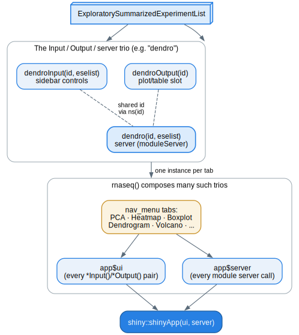

```{r setup, include = FALSE}
knitr::opts_chunk$set(
  collapse = TRUE,
  comment = "#>",
  eval = FALSE
)
```

This article is for people extending shinyngs, not just using it. It describes
the Shiny module convention the package is built on, how a module obtains its
data, the split between a module and its standalone plotting function, and a
step-by-step walkthrough for adding a new module. Code chunks are illustrative
and are not evaluated when this article is built.

## The big picture

shinyngs visualises data held in `ExploratorySummarizedExperiment` objects
(a `SummarizedExperiment` with a few extra descriptive slots), grouped into an
`ExploratorySummarizedExperimentList` (an `eselist`) that represents a whole
study. Almost every feature of the app is a Shiny *module*: a self-contained,
namespaced unit of UI plus server logic that can be reused anywhere without its
inputs and outputs colliding with another instance. Top-level apps such as
`rnaseq` are assembled from many of these modules.



## The Input / Output / server trio

The core convention: each module `xxx` is defined by three functions, usually
all living in `R/xxx.R`.

- `xxxInput(id, eselist)` returns the UI controls (the sidebar form elements).
- `xxxOutput(id)` returns the UI that displays results (typically a plot or
  table output slot).
- `xxx(id, eselist)` is the server function. It is *called directly* with the
  same `id` and wraps its logic in `shiny::moduleServer()`.

The `dendro` module is a compact example. `dendroInput()` builds the clustering
controls, `dendroOutput()` returns the plot slot, and `dendro()` is the server:

```r
dendroInput <- function(id, eselist) {
  ns <- NS(id)
  expression_filters <- selectmatrixInput(ns("dendro"), eselist)
  dendro_filters <- list(
    selectInput(ns("corMethod"), "Correlation method", c(Pearson = "pearson", ...)),
    selectInput(ns("clusterMethod"), "Clustering method", c(...)),
    groupbyInput(ns("dendro"))
  )
  fieldSets(ns("fieldset"), list(clustering = dendro_filters, expression = expression_filters))
}

dendroOutput <- function(id) {
  ns <- NS(id)
  moduleMain(
    "Sample clustering dendrogram",
    shinycssloaders::withSpinner(plotlyOutput(ns("sampleDendroPlot"), height = "480px"), color = shinyngsSpinnerColor()),
    help = modalInput(ns(dendro_modal$id), "help", "help")
  )
}

dendro <- function(id, eselist) {
  moduleServer(id, function(input, output, session) {
    modalServer(dendro_modal$id, dendro_modal$title)
    selectmatrix_reactives <- selectmatrix("dendro", eselist, select_genes = TRUE, var_n = 1000, ...)
    groupby_reactives <- groupby("dendro", eselist = eselist, group_label = "Color by", selectColData = selectmatrix_reactives$selectColData)
    # ... build the plot from those reactives, render to output$sampleDendroPlot
  })
}
```

Note the shape:

- Namespacing is explicit. UI functions call `ns <- NS(id)` and wrap every id
  in `ns(...)`; the server calls `moduleServer(id, ...)` and Shiny handles the
  namespace from there.
- The Input and Output functions must agree with the server on the *inner* ids
  (`"dendro"`, `"sampleDendroPlot"`), because that is how the three halves find
  each other.
- Modules compose. `dendroInput()` embeds `selectmatrixInput()` and
  `groupbyInput()`; `dendro()` embeds the matching `selectmatrix()` and
  `groupby()` servers.

### Convention for reactive arguments

Where a module passes a reactive to another function, the parameter name is
prefixed with `get` (`getTitle`, `getPalette`, `getColorby`,
`getNumberCategories`). This distinguishes a reactive from a plain value of the
same concept (for example the `colorby` column-name string a plotting function
takes). Keep those distinct: don't let the same name mean "a reactive" in one
layer and "a plain value" in another.

## How a module gets its data: `selectmatrix`

Most modules don't read the `eselist` directly. Instead they delegate data
selection to the `selectmatrix` module, which is the compositional core of the
package. `selectmatrixInput()` supplies controls to choose:

- which `ExploratorySummarizedExperiment` in the list to use,
- which assay of that experiment,
- which rows (via the `geneselect` submodule) and columns (via `sampleselect`).

The `selectmatrix()` server parses those inputs and returns a named list of
reactives that downstream modules consume. The most-used ones:

```r
selectmatrix_reactives <- selectmatrix("myMatrix", eselist, select_genes = TRUE)

selectmatrix_reactives$selectMatrix()      # the selected (row/col-filtered) matrix
selectmatrix_reactives$selectColData()     # colData for the selected samples
selectmatrix_reactives$getExperiment()     # the chosen ExploratorySummarizedExperiment
selectmatrix_reactives$getAssayMeasure()   # assay label, e.g. for axis titles
selectmatrix_reactives$matrixTitle()       # a human-readable title for the selection
```

`groupby` is the other module you'll almost always compose in: it provides the
"colour by" control (embedding the `colormaker` palette picker) and returns
`getGroupby()` (the chosen column name) and `getPalette()` (the reactive
palette). Because these are shared modules, any new plot module automatically
inherits experiment/assay/row/column selection, colour-by grouping, and the
colour-blind-safe palette, just by composing them.

## Module vs standalone plotting function

A shinyngs plotting module is intentionally thin. The actual plot is drawn by an
**exported, standalone function** that takes plain data (a matrix, a data
frame, a `colorby` column name, a palette) and knows nothing about Shiny. The
module's job is to gather reactives and call that function.

For the `boxplot` module (`R/boxplot.R`):

- `static_boxplot()` draws a static ggplot2 boxplot.
- `interactive_boxplot()` draws the interactive plotly version.
- `interactive_quartiles()` / `interactive_densityplot()` are the alternative renderings.

The server just wires reactives into them:

```r
output$sampleBoxplot <- renderPlotly({
  interactive_boxplot(
    selectmatrix_reactives$selectMatrix(),
    selectmatrix_reactives$selectColData(),
    groupby_reactives$getGroupby(),
    expressiontype = selectmatrix_reactives$getAssayMeasure(),
    palette = groupby_reactives$getPalette(),
    hidden_groups = hiddenGroups(),
    source = plot_source
  ) %>%
    shinyngsPlotlyConfig("boxplot", format = session$userData$plotFormat())
})
```

This split is a deliberate pattern, and the recent direction of the codebase has
been to *extract* render logic out of module servers into exported standalone
functions. The payoff: the plotting functions are documented, testable and
usable from a plain R script (no running app), and the module stays a thin
adapter. When you add or change a plot, put the drawing logic in an exported
`interactive_*` / `static_*` function and have the module call it.

> Gotcha: when extracting render logic into a standalone function, preserve the
> `bindCache()` scope. Several modules wrap their plot-building reactive in
> `bindCache(...)` keyed on exactly the inputs it reads, so re-rendering a tab
> (or another session viewing the same matrix and settings) reuses the result
> instead of recomputing. If you move code out of that reactive, make sure the
> cache key still covers every input the drawing now depends on, otherwise you
> either cache stale output or defeat the cache entirely.

## Adding a new module: a walkthrough

Say you want a `myplot` module. The steps:

**1. Create `R/myplot.R` with the trio.**

```r
myplotInput <- function(id, eselist) {
  ns <- NS(id)
  expression_filters <- selectmatrixInput(ns("myplot"), eselist)
  myplot_filters <- list(
    # your own controls, each id wrapped in ns()
    groupbyInput(ns("myplot"))
  )
  fieldSets(ns("fieldset"), list(settings = myplot_filters, expression = expression_filters))
}

myplotOutput <- function(id) {
  ns <- NS(id)
  moduleMain(
    "My plot",
    shinycssloaders::withSpinner(plotlyOutput(ns("myPlot")), color = shinyngsSpinnerColor()),
    help = modalInput(ns(myplot_modal$id), "help", "help")
  )
}

myplot <- function(id, eselist) {
  moduleServer(id, function(input, output, session) {
    selectmatrix_reactives <- selectmatrix("myplot", eselist)
    groupby_reactives <- groupby("myplot", eselist = eselist, selectColData = selectmatrix_reactives$selectColData)

    output$myPlot <- renderPlotly({
      interactive_myplot(
        selectmatrix_reactives$selectMatrix(),
        selectmatrix_reactives$selectColData(),
        groupby_reactives$getGroupby(),
        palette = groupby_reactives$getPalette()
      )
    })
  })
}
```

**2. Write the standalone plot function.** Put the drawing logic in an exported
`interactive_myplot()` (and/or `static_myplot()`) that takes plain arguments. Give it
a `palette_name = COLORBLIND_PALETTE_NAME` default so it produces consistent,
colour-blind-safe output when called outside an app.

**3. Add roxygen and export the right things.** Document all four functions with
roxygen blocks. Export the standalone plotting function(s) with `@export`; the
module trio follows the package convention of `@keywords shiny` and is generally
kept internal (unexported), matching the other modules. Run
`devtools::document()` to regenerate `NAMESPACE` and `man/`.

**4. Wire it into an app.** Because `prepare_app()` and `simpleApp()` locate a
module by name (`get(paste0(module, "Input"))`, `get(module)`, etc.), a
correctly-named trio is runnable standalone straight away:

```r
app <- prepare_app("myplot", eselist)
shiny::shinyApp(ui = app$ui, server = app$server)
```

To include it in a larger app such as `rnaseq`, add `myplotInput()` /
`myplotOutput()` to that app's layout and call `myplot()` in its server,
alongside the existing modules.

**5. Add tests.** Cover the standalone plotting function directly (it takes
plain data, so it's easy to test) and add any module-level tests alongside the
existing ones under `tests/`.

For contributor conventions (naming, the `get*`-reactive rule, running tests and
lints, and the document workflow) see `CONTRIBUTING.md`.
