```{r setup, include = FALSE}
knitr::opts_chunk$set(eval = FALSE)
```

This article is a browsable reference to the analysis panels a `shinyngs`
application can present. Each entry describes what the panel shows and what
inputs it needs, drawn from the per-panel help text that the app itself
surfaces via the help icons in each panel's header.

Most panels are built on Shiny modules and share a common set of controls.
In particular, plotting panels use the `selectmatrix` control group to choose
an **experiment** and **assay** (a features x samples matrix), and to subset
its rows and columns. Where variance-based row selection is offered, the 1000
most variant rows are selected by default, since the strongest patterns are
usually clearest in the more variable features. Panels that operate on
differential results additionally require **contrasts** (comparisons between
sample groups, with results in the object's `tests` slot), and gene-set panels
require uploaded **gene sets** (e.g. GO, KEGG, from GMT files).

Every plot below is backed by a standalone plotting function you can call
directly on your own data. See
[reusing these plots outside Shiny](reuse.html) for how to drive those
functions without launching an app.

## Exploratory

Panels for getting a first look at structure, quality, and clustering across
samples. These operate on assay matrices and sample metadata; they do not
require differential results.

### PCA

Principal component analysis reduces high-dimensional data (tens of thousands
of features) to a handful of components, each a fixed linear combination of the
original features. The **components plot** plots the first components against
one another and should separate samples by the strongest patterns in the data;
colouring points by a sample variable (treatment, sex, sequencing lane) reveals
which factors drive that structure. The **loading plot** shows which features
contributed most to each component, and the **scree plot** shows the percentage
of variance explained by each component (plus the cumulative total), helping you
judge how many components are worth examining.

*Inputs:* an assay matrix (variable rows selected by default), a choice of which
components to display, and a sample variable to colour by.
*Backed by:* `compilePCAData`, with points drawn via `plotly_scatterplot` and
the scree curve via `plotly_screeplot`.

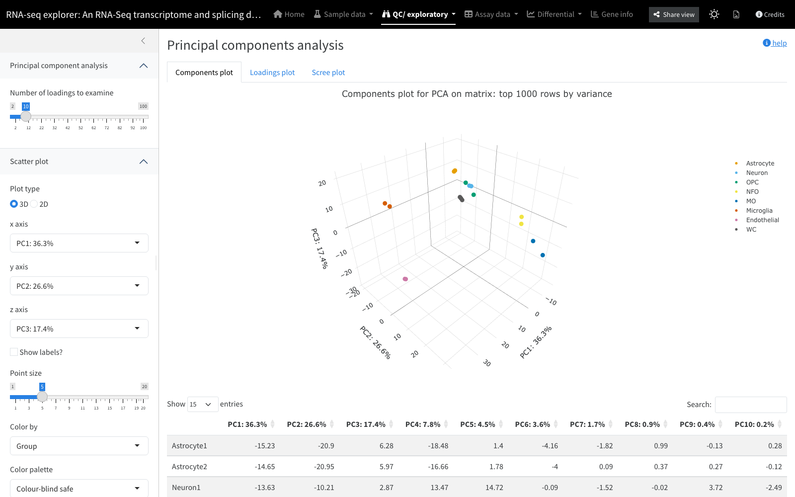

<br/>

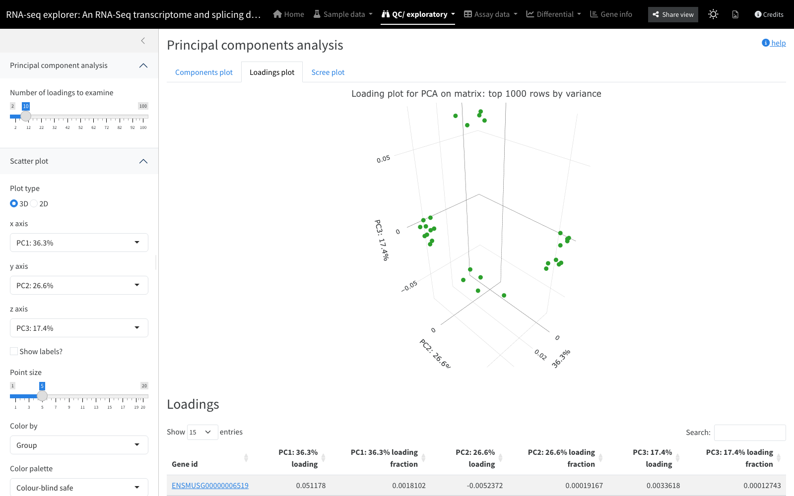

<br/>

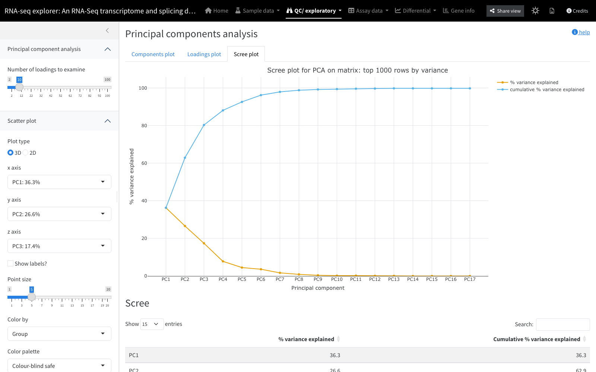

### PCA vs experiment

A companion to the PCA panel that helps interpret what the components mean. An
analysis of variance is run for each component against each experimental factor,
and the resulting matrix of p-values is drawn as a heatmap. Ideally the key
experimental variables are associated with the first, highest-variance
components; strong association of a technical factor (e.g. sequencing lane) with
an early component flags a variable to account for downstream.

*Inputs:* an assay matrix (variable rows by default) and the set of experimental
variables to test.
*Backed by:* `plotly_pca_metadata_heatmap`.

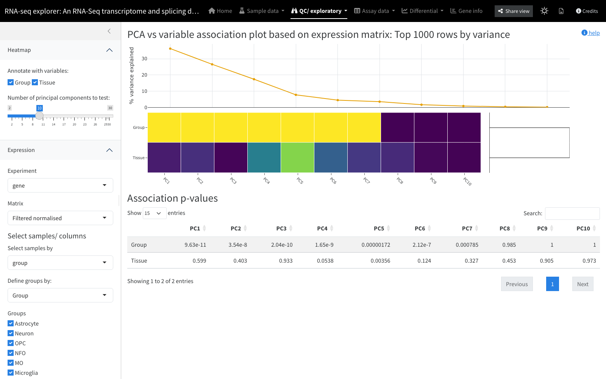

### Sample clustering heatmap

Computes a matrix of correlation values between pairs of samples and draws it as
a heatmap with an accompanying dendrogram, an alternative view of sample
relatedness to the dendrogram panel. Experimental annotations can be added as
coloured bars above the heatmap via the "Annotate with variables" control.

*Inputs:* an assay matrix (variable rows by default) and optional annotation
variables.
*Backed by:* `interactiveHeatmap`.

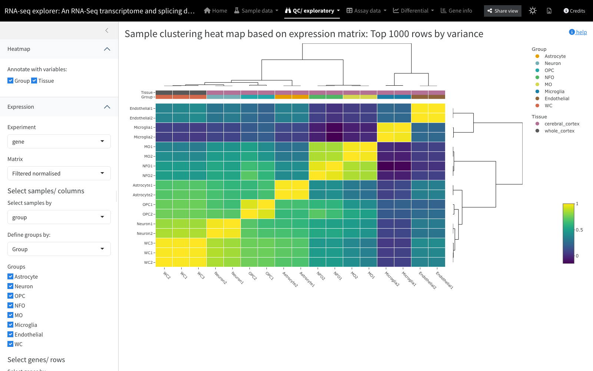

### Dendrogram

Displays sample clustering dendrograms showing how related samples are to one
another. If samples do not group as expected, the differential expression you
are looking for between groups may not be present. Clustering controls let you
choose the distance/similarity measure and the hierarchical clustering method,
and you can colour samples by an experimental variable to aid interpretation.

*Inputs:* an assay matrix (variable rows by default; row selection may also be
"all" or a supplied gene set) and distance/clustering choices.
*Backed by:* `plotly_clusteringDendrogram`.

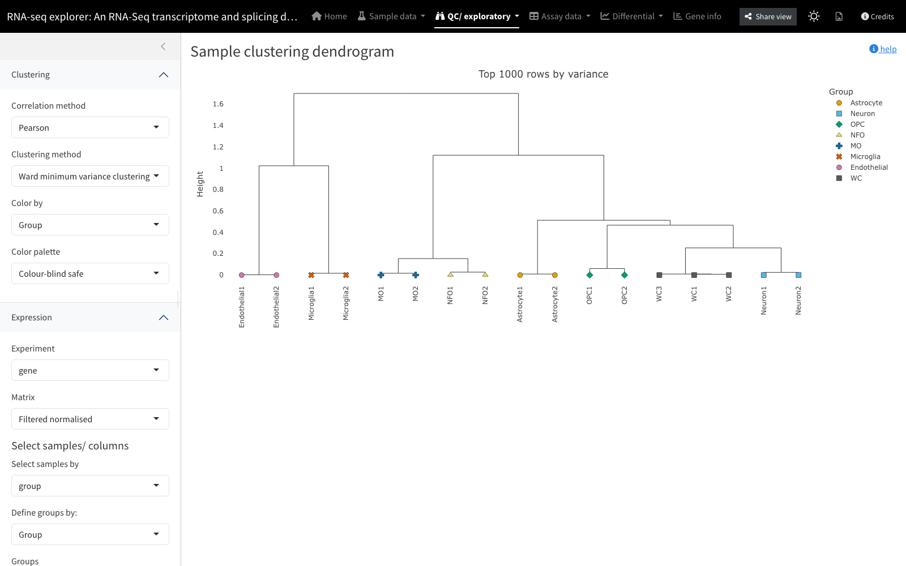

### Boxplots / density

Illustrates the distribution of values in each sample, as box plots (via
`ggplot2`) or lines/density (via Plotly). A very atypical distribution in a
sample, for example an unusually low mean, can point to sample-quality problems.
Box plots become unmanageable beyond about 20 samples, so line plots are the
default for larger sample counts. Whiskers extend to 1.5x the interquartile
range by default; points beyond them are treated as outliers, and mousing over
an outlier in the line plots reveals its identity.

*Inputs:* an assay matrix; comparing raw versus normalised matrices can be
informative.
*Backed by:* `plotly_boxplot`, `plotly_densityplot`, and `plotly_quartiles`.

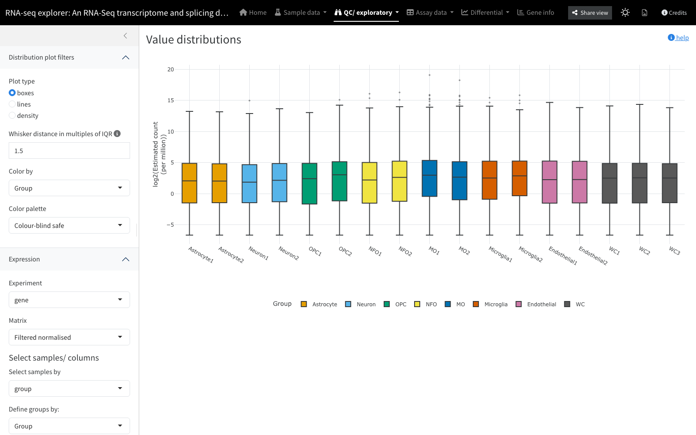

### Expression heatmap

A standard expression heatmap plotted interactively with `heatmaply`. Clustering
dendrograms use a Spearman-correlation distance passed to the `ward.D2` method
of `hclust()`. Colours are scaled by row by default so trends can be compared
across rows. The data can optionally be summarised into means per sample group.

*Inputs:* an assay matrix, with rows selectable by variance, by an explicit
list, or (where gene sets are uploaded) by a predefined gene set.
*Backed by:* `interactiveHeatmap`.

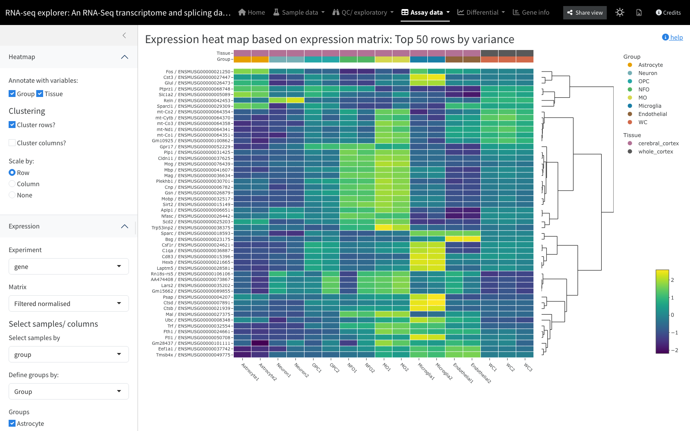

### Clustering profiles

Examines clustering patterns within a subset of a matrix. The matrix is
re-scaled by row to give comparable profiles, and a chosen number of clusters is
produced with the `clara()` method from the `cluster` package. The number of
clusters is the key control, and three display modes are offered: a sample of up
to 100 profiles per cluster, or summary statistics (mean or median) with error
bars or a filled variability band. A per-cluster membership matrix can be
exported for further investigation.

*Inputs:* an assay matrix (variable rows by default) and the number of clusters.
*Backed by:* `plotly_cluster_profiles`.

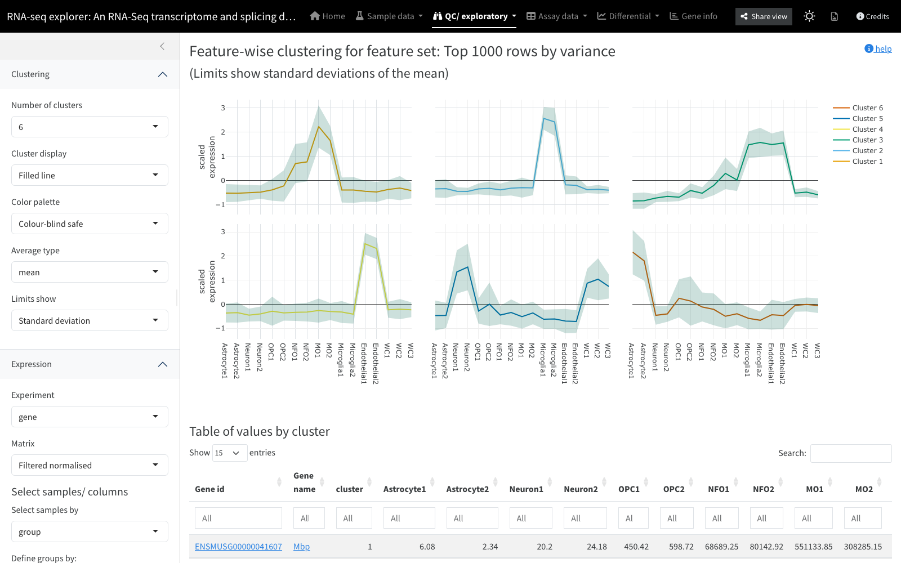

## Differential

Panels that visualise or tabulate the results of differential testing. All
require **contrasts** with statistics (p- and q-values) in the object's `tests`
slot; where only a single assay carries tests, no matrix selector is shown.
Fold changes are computed dynamically from the chosen assay matrix and the way
group-wise averages are calculated (mean by default).

### Differential table

View and download the differential statistics: p-values and adjusted p-values
(computed prior to loading) alongside fold changes (computed dynamically).
Controls select which contrasts to display and apply thresholds. Dynamic filters
under "Contrasts" allow complex queries, combining different filter sets across
contrasts by intersection (default) or union, for example "features highly
significantly up in contrast A but unchanged in contrast B".

*Inputs:* contrasts with test statistics; an assay matrix for fold changes.

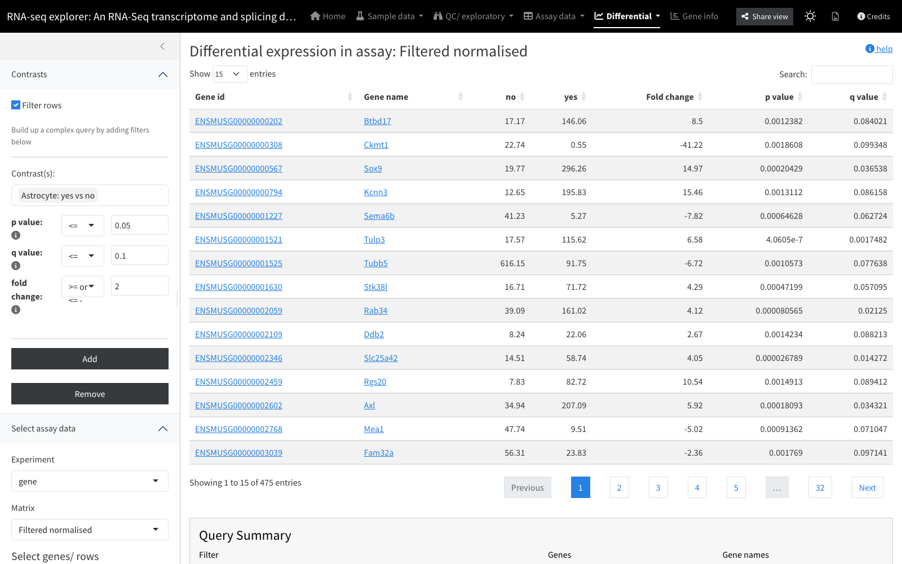

### Volcano plot

Plots log2 fold change (x, sign preserved) against -log10 p-value (y), drawn
with Plotly. High-magnitude, low-variability changes land at the top-left and
top-right extremes, the points of most interest. Points passing the fold-change
and q-value thresholds are drawn in active blue with mouse-over detail; those
below are inert grey (labelling every point would slow the browser).

*Inputs:* a contrast, fold-change and q-value thresholds, and optionally a set
of genes to highlight by colour.
*Backed by:* `plotly_scatterplot`.

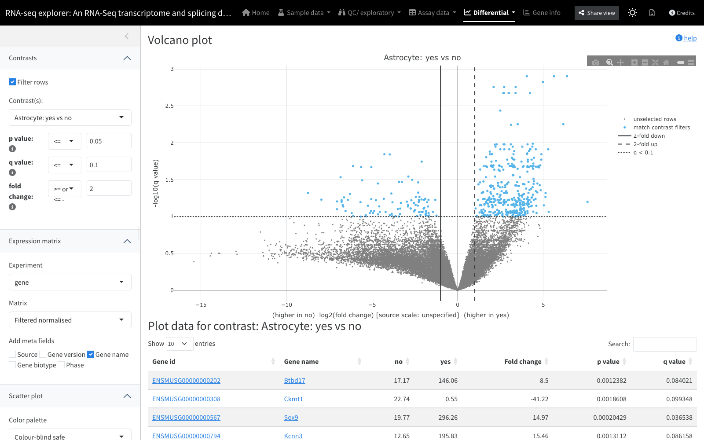

### MA plot

Illustrates the relationship between mean expression and fold change, overlaid
with significance from a statistical test. At low expression a small absolute
difference yields a large fold change that falls within normal variability and
is not significant; as expression rises, smaller fold changes become
significant. Same threshold and highlight controls as the volcano plot.

*Inputs:* a contrast, fold-change and q-value thresholds, optional highlight set.
*Backed by:* `plotly_scatterplot`.

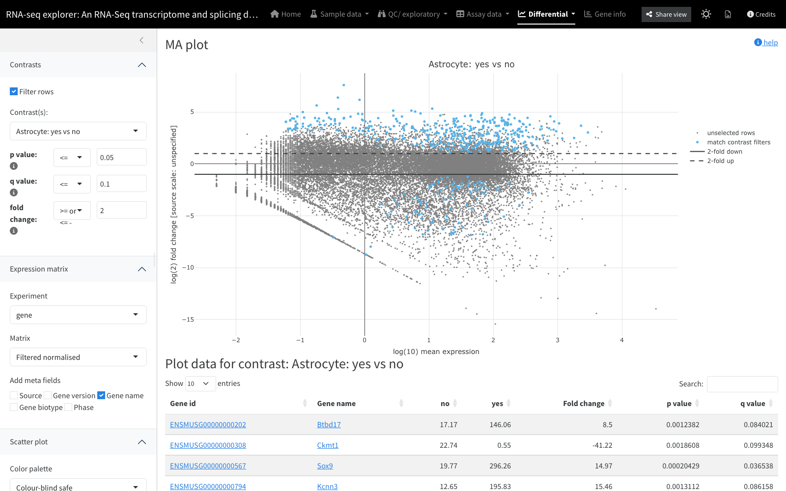

### Fold change plot

A simple scatter plot comparing the mean expression value between two groups of
samples for every row of a matrix, drawn with Plotly. Points are grey, or blue
where they pass the fold-change and (where available) q-value thresholds.

*Inputs:* an assay matrix, a contrast, thresholds, optional highlight set.
*Backed by:* `plotly_scatterplot`.

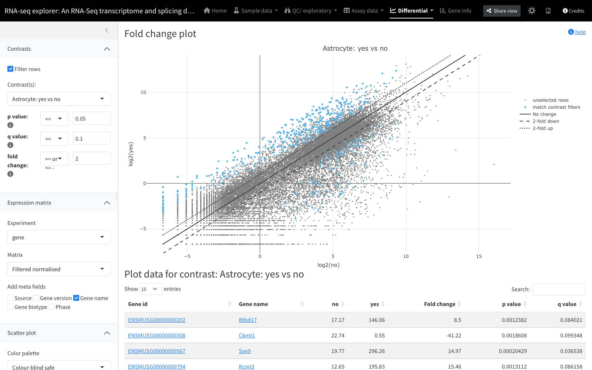

### Top gene boxplots

A faceted boxplot for the most differentially expressed genes in a chosen
contrast: one panel per gene, samples grouped by the contrast's two conditions,
with the gene's q-value annotated on its panel and an optional per-sample
beeswarm overlay. Genes passing the significance filters can be ranked by
q-value or by (absolute) fold change ascending/descending, and the number drawn
is capped by a control. A colour-blind-safe palette is the default.

*Inputs:* a contrast, significance thresholds, a ranking metric, a gene count,
and a colour palette.
*Backed by:* `plotly_topgene_boxplots`.

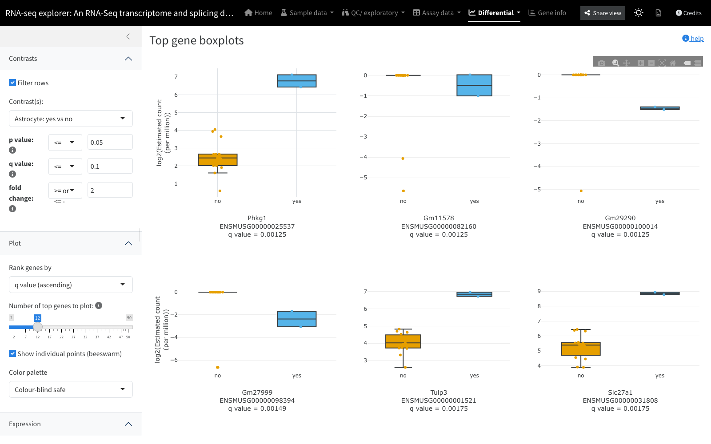

### UpSet

An UpSet set-intersection plot (after Lex, Gehlenborg et al.), where the sets are
gene lists derived from the supplied contrasts and filters. You can restrict the
number of contrasts considered and the number of intersections shown. The
intersection type defaults to exclusive (Venn/Euler-style, so bars sum to the
total), or can be set to "Complete" so each bar reflects the full pairwise
intersection (bars then overlap and no longer sum to the total). The plot is
downloadable.

*Inputs:* contrasts with thresholds, and an assay matrix for generating the
comparisons.
*Backed by:* `plotly_upset`.

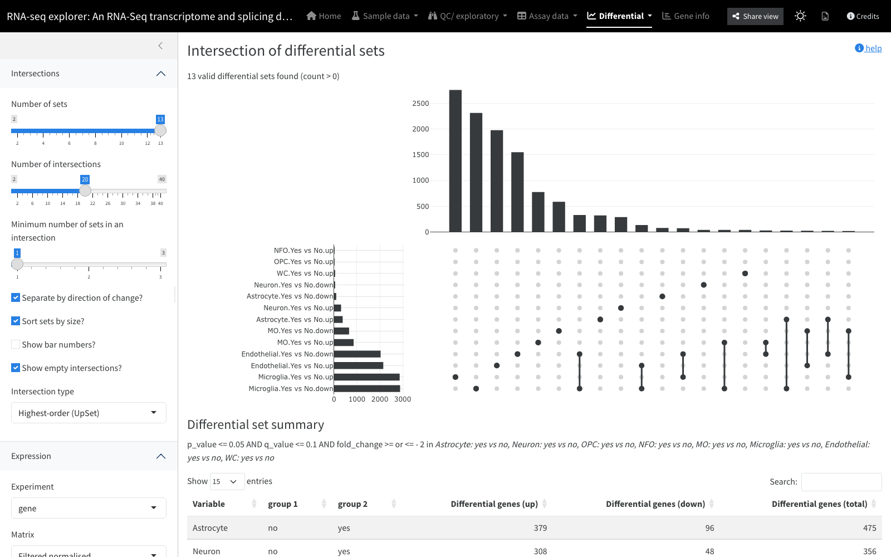

## Gene-level

Panels centred on individual genes or gene sets.

### Gene page (and gene model)

Detailed information for one or more genes selected by label or identifier. It
combines an **expression bar plot** (expression per sample, optionally coloured
by an experimental variable) with a **gene info** table of annotation (with
links out to external resources where configured), a **contrasts table** listing
that gene's differential results across all defined contrasts, and, where the
experiment has an associated Ensembl species, a **gene model** view: an
interactive genome-browser diagram of the gene's exon/transcript structure.

*Inputs:* one or more selected genes; an assay matrix and a "colour by" variable
for the bar plot; contrasts for the results table; an Ensembl species (plus
`chromosome_name`/`start_position`/`end_position` feature metadata) for the gene
model.
*Backed by:* `plotly_scatterplot` for the expression bar plot; the gene model
view uses the `igvShiny` (igv.js) browser.


### Gene-set barcode plot

An interactive barcode plot reproducing the statistics behind limma's
`barcodeplot()` and building on Subramanian et al. (GSEA). It shows where the
members of one gene set fall in the overall list of genes ranked by fold change
between two conditions; "bunching up" at one extreme indicates coordinated up-
or down-regulation. The FDR is annotated where available, hovering a tick shows
the gene and its fold change, and an accompanying table gives contrast detail for
the set.

*Inputs:* a single selected gene set, a contrast, and an assay matrix (note the
displayed FDR may correspond to only one of the available matrices).
*Backed by:* `plotly_barcodeplot`.

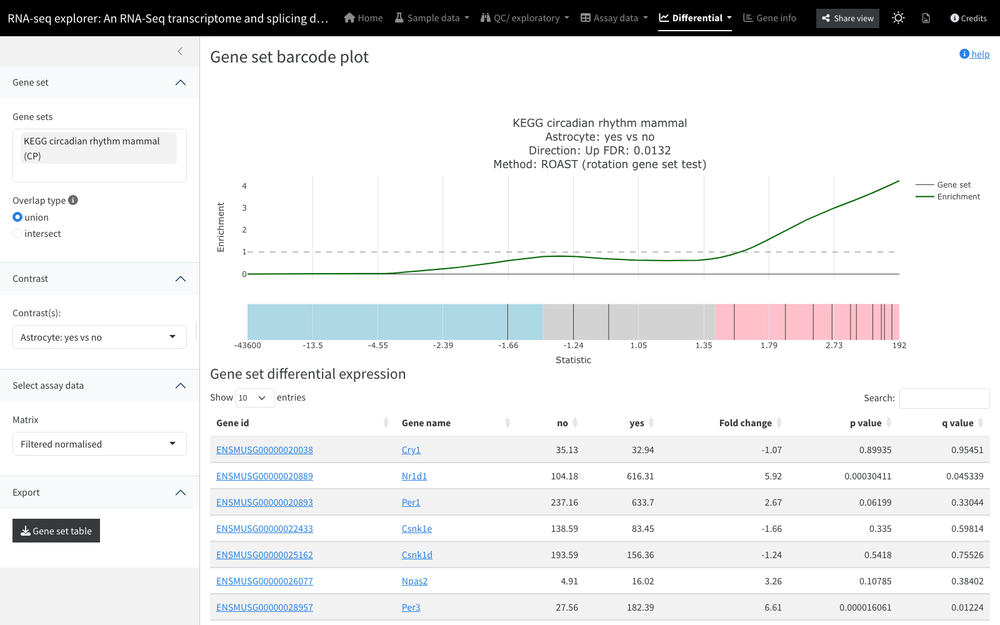

### Gene-set analysis table

A gene set analysis table, potentially produced by a variety of methods (the
"Method" line names the tool, e.g. GSEA or ROAST, that generated the current
results), typically showing gene sets with p-values and FDRs. Filters select a
single gene-set type (e.g. KEGG) and optionally specific sets. For convenience,
the significantly differential genes of the appropriate direction are annotated
to each set; the default is to filter those genes only on unadjusted p-value,
since selection has already been applied at the set level. Gene sets link
through to the barcode plot, and individual genes to their expression bar plots.

*Inputs:* precomputed gene set analysis results, a gene-set type, and a contrast
with gene-level thresholds.

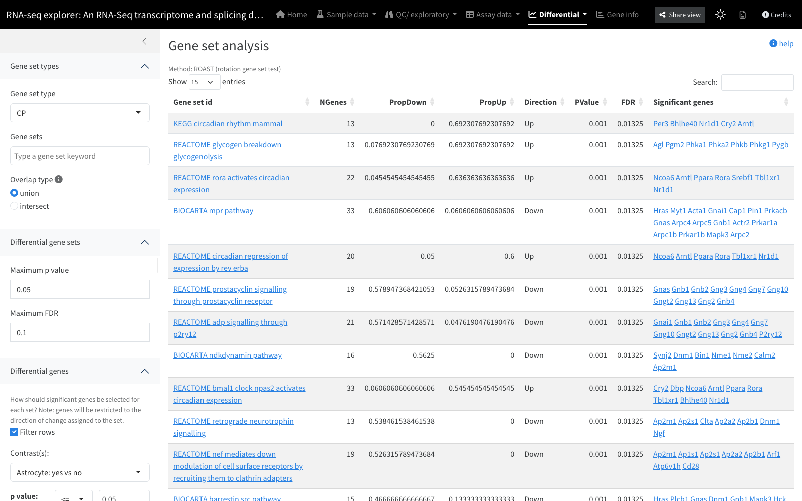

## QC / platform-specific

Panels tied to a particular assay platform or analysis method.

### Illumina array QC

Plots the mean of the Illumina control probes for each sample, grouped by
condition. Expected relationships to check (listed alongside the plot) include
`cy3_high > cy3_med > cy3_low`, low stringency near zero, high stringency at or
below cy3 high, housekeeping and biotin high, and negative controls near zero.

*Inputs:* Illumina control-probe measurements per sample.
*Backed by:* `plotly_illumina_control_probes`.

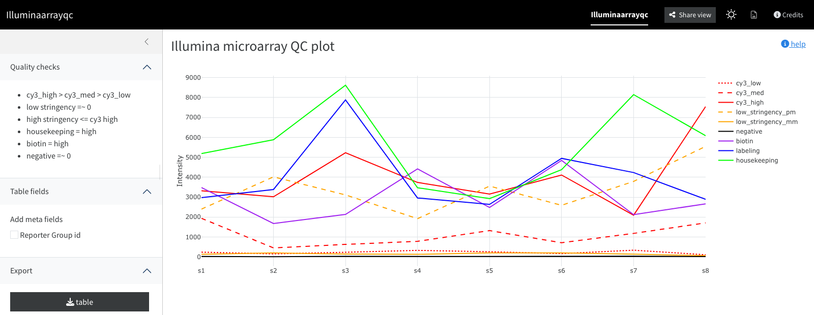

### DEXSeq plot

Visualises the output of the DEXSeq package for differential exon usage between
conditions. Per exon and sample, DEXSeq considers the ratio of reads mapping to
that exon versus other exons of the same gene, and how that ratio changes across
conditions. Individual sub-plots can be toggled: model-derived **expression**
per condition, **exon usage** coefficients, per-sample **normalised counts**, a
**gene model** colouring exons pink where significant differential usage is
seen, and a **transcripts** view for comparing usage against known transcript
structures. An accompanying table gives normalised exon counts and relative exon
usage per condition.

*Inputs:* DEXSeq results, a gene to plot, an FDR threshold for colouring exons,
and which sub-plots to show.

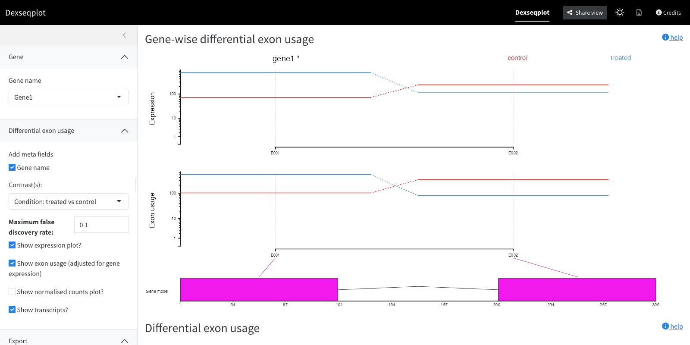

### DEXSeq table

The tabular counterpart to the DEXSeq plot: normalised exon count and relative
exon usage per condition, where large usage changes appear as large fold changes
and low FDR-adjusted p-values. Controls filter on fold change and adjusted
p-value; by default only the single most significant differential exon per gene
is shown (untick to show all).

*Inputs:* DEXSeq results and fold-change/FDR filters.

### Read reports

Summaries of read counts, drawn as Plotly bar plots from information supplied
when the resource was built. Example reports include a **read attrition plot**
(where reads were lost across analysis stages, drawn as overlapping bars since
each stage is a subset of the previous), a **read distribution plot** (reads by
genomic feature type such as exon or intron), and a **read gene-type plot** (by
gene biotype, e.g. protein coding or rRNA).

*Inputs:* precomputed read-summary tables provided with the dataset.
*Backed by:* `plotly_barchart` / `plotly_count_barplot`.

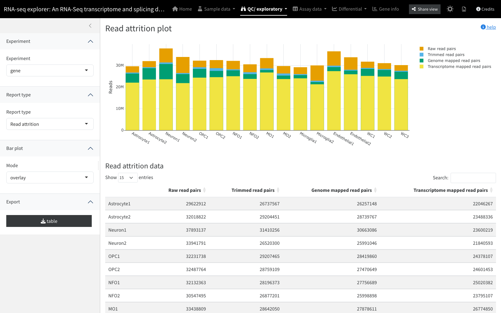

## Data tables

Panels for viewing and downloading the underlying data and metadata.

### Assay data table

View and download the raw matrix data held in the `assays` slots. The data are
organised into **experiments** (each with its own set of features, e.g. one for
transcripts and one for genes), and each experiment holds multiple **assays**
(measurements of the same features and samples, or different processing levels).
The data can optionally be summarised into means per sample group.

*Inputs:* a choice of experiment and assay, plus row and column selection.

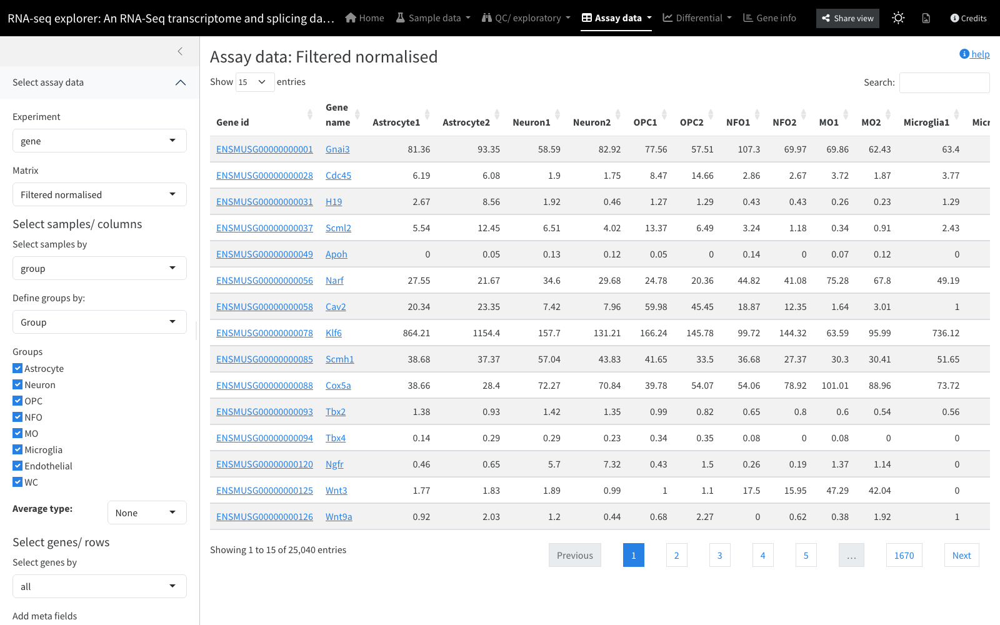

### Sample metadata table

Shows the experimental information supplied alongside the primary data (used, for
example, for batch correction or to define comparison groups); factors from this
table colour plots elsewhere in the app. A **Category counts** tab counts samples
by a categorical field (e.g. per treatment group), optionally split by a second
field into grouped or stacked bars. Identifier-like fields (near-unique per row)
are not offered for counting.

*Inputs:* sample (column) metadata.

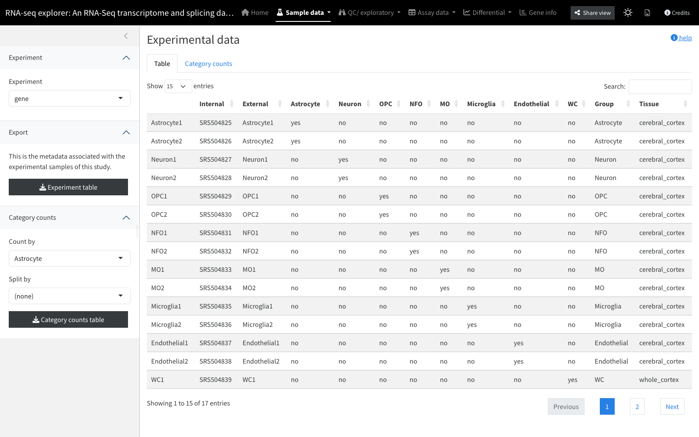

<br/>

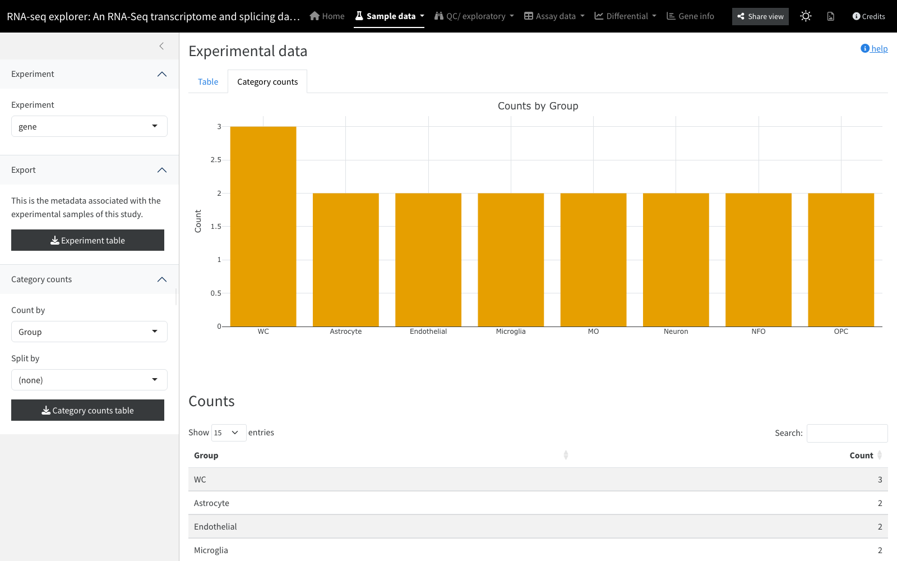

### Row / feature metadata table

Shows the metadata associated with each matrix row (e.g. genes or transcripts)
in the selected experiment; its content depends on what was added during
analysis. As with the sample table, a **Category counts** tab counts rows by a
categorical field (e.g. genes per biotype), optionally split by a second field,
excluding identifier-like fields.

*Inputs:* row (feature) metadata for the selected experiment.

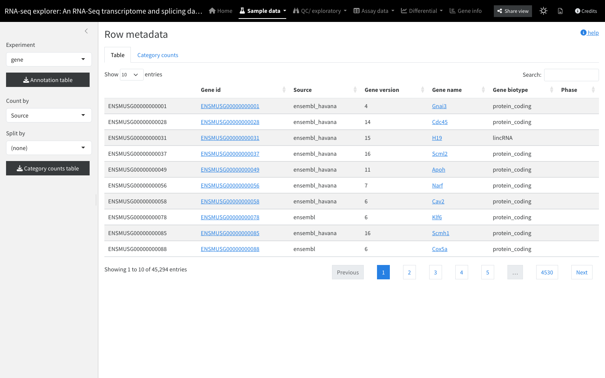

<br/>

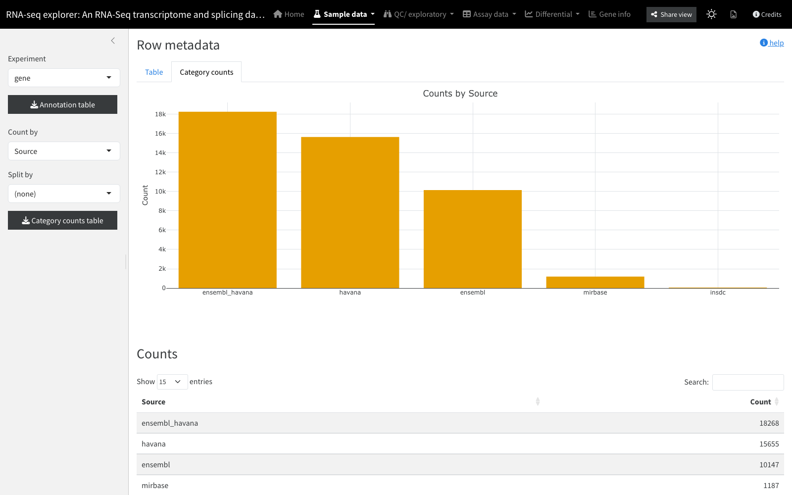
