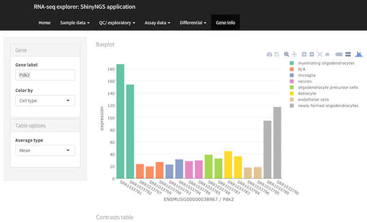
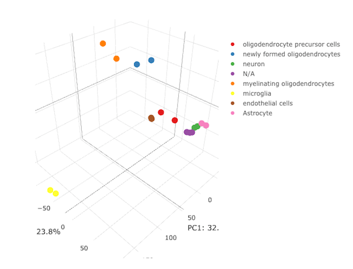

# Intro

`r Githubpkg("pinin4fjords/shinyngs")` is a package designed to facilitate downstream analysis of RNA-seq and similar matrix data with various exploratory plots. It's a work in progress, with new features added on a regular basis. Individual components (heatmaps, pca etc) can function independently and will be useful outside of the RNA-seq context.



# Motivation

It's not always trivial to quickly assess the results of next-generation sequencing experiment. `r Githubpkg("pinin4fjords/shinyngs")` is designed to help fix that by providing a way of instantly producing a visual tool for data mining at the end of an analysis pipeline. 

# Features

* A variety of single and multiple-panel Shiny applications- currently heatmap, pca, boxplot, dendrogram, gene-wise barplot, various tables and an RNA-seq app combining all of these.
* Leveraging of libraries such as [DataTables](https://rstudio.github.io/DT/) and [Plotly](https://plot.ly/) for rich interactivity.
* Takes input in an extension of the commonly used `SummarizedExperiment` format, called `ExploratorySummarizedExperiment` 
* Interface kept simple where possible, with complexity automatically added where required:
    * Input field clutter reduced with the use of collapses from [shinyBS](https://ebailey78.github.io/shinyBS/index.html) (when installed).
    * If a list of `ExploratorySummarizedExperiment`s is supplied (useful in situations where the features are different beween matrices - e.g. from transcript- and gene- level analyses), a selection field will be provided.
    * If a selected experiment contains more than one assay, a selector will again be provided.
* For me: leveraging of [Shiny modules](http://shiny.rstudio.com/articles/modules.html). This makes re-using complex UI components much easier, and maintaining application code is orders of magnitude simpler as a result.

# Installation

## Prerequisites

`shinyngs` relies heavily on `SumamrizedExperiment`. Formerly found in the `GenomicRanges` package, it now has its own package on Bioconductor: http://bioconductor.org/packages/release/bioc/html/SummarizedExperiment.html. This requires a recent version of R. 

Graphical enhancements are provided by `shinyBS` and `shinyjs`

## Install with devtools

```{r, eval=FALSE}
library(devtools)
install_github('pinin4fjords/shinyngs')
```

# Concepts and data structures

The data structures used by Shinyngs build on `SummarizedExperiment`. One `SummarizedExperiment` can have multiple 'assays', essentially matrices with samples in columns and 'features' (transcripts or genes) in rows, representing different results for the same features and samples. This is handy to compare results before and after processing, for example. `ExploratorySummarizedExperiment` extends `SummarizedExperiment` to include slots relating to annotation, and associated results of 'tests', providing p values and q values.  

`ExploratorySummarizedExperimentList` is a container for one or more `ExploratorySummarizedExperiment` objects, and is intented to describe an overall study, i.e. one or more experiments the same set of samples, but different sets of features in each experiment. The `ExploratorySummarizedExperimentListList` therefore is used to supply study-wide things such as contrasts, gene sets, url roots for creating links etc. 

# Quickstart: working from a SummarizedExperiment

To see how to quickly build an RNA-seq app from a simple SummarizedExperiment, we can use the example data in the `airway` package. We just convert the RangedSummarizedExperiment to an ExploratorySummarizedExperiment, and add it to a list of such objects, which represent a study.

```{r eval = FALSE}
library(shinyngs)

data(airway, package = 'airway')
ese <- as(airway, 'ExploratorySummarizedExperiment')
eselist <- ExploratorySummarizedExperimentList(ese)
```

Then we build and run the app. For example, a basic app just for heatmaps:

```{r eval = FALSE}
app <- prepareApp('heatmap', eselist)
shiny::shinyApp(ui = app$ui, server = app$server)
```

... or a more comprehensive one with multiple panels aimed at RNA-seq:

```{r eval = FALSE}
app <- prepareApp('rnaseq', eselist)
shiny::shinyApp(ui = app$ui, server = app$server)
```

Airway provides some info about the dataset, which we can add in to the object before we build the app:

```{r eval = FALSE}
data(airway, package = 'airway')
expinfo <- metadata(airway)[[1]]

eselist <- ExploratorySummarizedExperimentList(
  ese,
  title = expinfo@title,
  author = expinfo@name,
  description = abstract(expinfo)
)
app <- prepareApp('rnaseq', eselist)
shiny::shinyApp(ui = app$ui, server = app$server)
```

All this app knows about is gene IDs, however, which aren't all that informative for gene expression plots etc. We can add row metadata to fix that:

```{r eval = FALSE}
# Use Biomart to retrieve some annotation, and add it to the object

library(biomaRt)
attributes <- c(
  'ensembl_gene_id', # The sort of ID your results are keyed by
  'entrezgene', # Will be used mostly for gene set based stuff
  'external_gene_name' # Used to annotate gene names on the plot
)

mart <- useMart(biomart = 'ENSEMBL_MART_ENSEMBL', dataset = 'hsapiens_gene_ensembl', host='www.ensembl.org')
annotation <- getBM(attributes = attributes, mart = mart)
annotation <- annotation[order(annotation$entrezgene),]

mcols(ese) <- annotation[match(rownames(ese), annotation$ensembl_gene_id),]

# Tell shinyngs what the ids are, and what field to use as a label

ese@idfield <- 'ensembl_gene_id'
ese@labelfield <- 'external_gene_name'

# Re-build the app

eselist <- ExploratorySummarizedExperimentList(
  ese,
  title = expinfo@title,
  author = expinfo@name,
  description = abstract(expinfo)
)
app <- prepareApp('rnaseq', eselist)
shiny::shinyApp(ui = app$ui, server = app$server)
```

# More complex use case: the `zhangneurons` Example dataset

`airway` is fine, but it contains no information on differential expression. `shinyngs` provides extra slots for differential analyses, among other things.

An example `ExploratorySummarizedExperimentList` based on the Zhang et al study of neurons and glia (http://www.jneurosci.org/content/34/36/11929.long) is included in the package, and this can be used to demonstrate available features. The dataset includes transcript- and gene- level quantification estimates (as `ExporatorySummarizedExperiment`s within an `ExploratorySummarizedExperimentList`, and three levels of processing (raw, filtered, normalised) in the `assays` slots of each.  

Note: this data was generated using Salmon (https://combine-lab.github.io/salmon/) for quantification, and results may therefore be slightly different to the authors' online tool (which did not use Salmon).

```{r eval=FALSE}
library(shinyngs)
data("zhangneurons")
```

## Use example data to make some applications

An example `ExploratorySummarizedExperimentList` based on the Zhang et al study of neurons and glia (http://www.jneurosci.org/content/34/36/11929.long) is included in the package, and this can be used to demonstrate available features.

```{r eval=FALSE}
app <- prepareApp("rnaseq", zhangneurons)
shiny::shinyApp(app$ui, app$server)
```

Note the use of `prepareApp` to generate the proper `ui` and `server`, which are then passed to Shiny. This example generates the full application designed for RNA-seq analysis. But apps with just individual components can be created too:

```{r eval=FALSE}
app <- prepareApp("heatmap", zhangneurons)
shiny::shinyApp(app$ui, app$server)
```

# Building an application from a YAML file

The `eselistFromYAML()` function is provided to help construct an ExploratorySummarizedExperiment object. You might make a file like:

```
title: My RNA seq experiment
author: Joe Blogs
report: report.md
group_vars:
  - Group
  - Replicate
default_groupvar: Group
experiments:
  Gene:
    coldata:
      file: my.experiment.csv
      id: External
    annotation:
      file: my.annotation.csv
      id: gene_id
      entrez: ~
      label: gene_id
    expression_matrices:
      Raw:
        file: raw_counts.csv
        measure: counts
      Filtered:
        file: filtered_counts.csv
        measure: Counts per million
      Normalised:
        file: normalised_counts.csv
        measure: Counts per million
    read_reports:
      read_attrition: read_attrition.csv
contrasts:
  comparisons:
    0:
    - Group
      control
      TreatmentA
    1:
    - Group
      control
      TreatmentB
stats:
  Gene:
    Normalised:
      pvals: pvals.csv
      qvals: qvals.csv
```

You can then generate the object with a command like `eselist <- eselistFromYAML('my.yaml')`. 

# Building an application from scratch

To demonstrate this, let's break down `zhangneurons` into simple datatypes and put it back together again. 

## Assays

```{r eval=TRUE}
# Assays is a list of matrices
data(zhangneurons, envir = environment())
myassays <- as.list(SummarizedExperiment::assays(zhangneurons[[1]]))
head(myassays[[1]])
```

## colData

colData is your sample information defining groups etc

```{r eval=TRUE}
mycoldata <- data.frame(SummarizedExperiment::colData(zhangneurons[[1]]))
head(mycoldata)
```

## Annotation

Annotation is important to `shinyngs'. You need a data frame with rows corresonding to those in the assays

```{r eval=TRUE}
myannotation <- SummarizedExperiment::mcols(zhangneurons[[1]])
head(myannotation)
```

## Making an `ExploratorySummarizedExperiment`

Now we can put these things together to create an 'ExploratorySummarizedExperiment: 

```{r eval=TRUE}
myese <- ExploratorySummarizedExperiment(
    assays = SimpleList(
      myassays
    ),
    colData = DataFrame(mycoldata),
    annotation <- myannotation,
    idfield = 'gene_id',
    labelfield = "gene_name"
  )
print(myese)
```

Note the extra fields that mostly tell `shinyngs` about annotation to help with labelling etc.

## Making an `ExploratorySummarizedExperimentList` 

`ExploratorySummarizedExperimentList`s are basically a list of `ExploratorySummarizedExperiment`s, with additional metadata slots.

```{r eval=TRUE}
myesel <- ExploratorySummarizedExperimentList(
  eses = list(expression = myese),
  title = "My title",
  author = "My Authors",
  description = 'Look what I gone done'
)
```

You can use this object to make an app straight away:

```{r eval=FALSE}
app <- prepareApp("rnaseq", myesel)
shiny::shinyApp(app$ui, app$server)
```

... but it's of limited usefulness because the sample groupings are not highlighted. We need to specify `group_vars` for that to happen, picking column names from the `colData`:

```{r eval=TRUE}
myesel@group_vars <- c('Group', 'Tissue')
```

.. then if we re-make the app you should see group highlighting.

```{r eval=FALSE}
app <- prepareApp("rnaseq", myesel)
shiny::shinyApp(app$ui, app$server)
```

... for example, in the PCA plot



## Specifying contrasts for differential outputs

But where are the extra plots for looking at differential expression? For those, we need to supply contrasts. Contrasts are supplied as a list of character vectors describing the variable in `colData` upon the contrast is based, and the two values of that variable to use in the comparison. We'll just copy the one over from the original `zhangneurons`: 

```{r eval=TRUE}
zhangneurons@contrasts
myesel@contrasts <- zhangneurons@contrasts
```

Run the app again and you should see tables of differential expression, and scatter plots between pairs of conditions. 

```{r eval=FALSE}
app <- prepareApp("rnaseq", myesel)
shiny::shinyApp(app$ui, app$server)
```

But without information on the significance of the fold changes, we can't make things like volcano plots. For those we need to populate the `contrast_stats` slot. contrast_stats is a list of lists of matrices in the `ExploratorySummarizedExperiment` objects, with list names matching one or more of the names in `assays`, second-level names being 'pvals' and 'qvals' and the columns of each matrix corresponding the the `contrasts` slot of the containing `ExploratorySummarizedExperimentList`:

```{r eval=TRUE}
head(zhangneurons[[1]]@contrast_stats[[1]]$pvals, n = 10)
```

Again, we'll just copy those data from `zhangneurons` for demonstration purposes:

```{r eval=TRUE}
myesel[[1]]@contrast_stats <- zhangneurons[[1]]@contrast_stats
```

Now the RNA-seq app is more or less complete, and you should see volcano plots under 'Differential':

```{r eval=FALSE}
app <- prepareApp("rnaseq", myesel)
shiny::shinyApp(app$ui, app$server)
```

# Gene sets

Many displays are more useful if they can be limited to biologically meaningful sets of genes. The `gene_sets` slot is designed to allow that. Gene sets are stored as lists of character vectors of gene identifiers, each list keyed by the name of the metadata column to which they pertain. 

## Adding gene sets to enable gene set filtering

The constructor for `ExploratorySummarizedExperimentList` assumes that gene sets are represented by the ID type specified in the `gene_set_id_type_slot`, and that they are specified as a list of `GeneSetCollection`s. You might generate such a list as follows:

```{r eval=FALSE}
genesets_files = list(
  'KEGG' =  "/path/to/MSigDB/c2.cp.kegg.v5.0.entrez.gmt",
  'MSigDB canonical pathway' = "/path/to/MSigDB/c2.cp.v5.0.entrez.gmt",
  'GO biological process' = "/path/to/MSigDB/c5.bp.v5.0.entrez.gmt",
  'GO cellular component' = "/path/to/MSigDB/c5.cc.v5.0.entrez.gmt",
  'GO molecular function' = "/path/to/MSigDB/c5.mf.v5.0.entrez.gmt",
  'MSigDB hallmark'= "/path/to/MSigDB/h.all.v5.0.entrez.gmt"
)

gene_sets <- lapply(genesets_files, GSEABase::getGmt)
```

Then provide them during object creation:

```{r eval = FALSE}
myesel <- ExploratorySummarizedExperimentList(
  eses = list(expression = myese),
  title = "My title",
  author = "My Authors",
  description = 'Look what I gone done',
  gene_sets = gene_sets
)
```

These are then converted internally to a list of lists of character vectors of gene IDs. The top level is keyed by the type of gene ID to be used for labelling (stored in `labelfield' on `ExploratorySummarisedExperiments`, the next level by the type of gene set.

For the `zhangneurons` example, gene sets are stored by `gene_name`:

```{r eval = TRUE}
names(zhangneurons@gene_sets)
```

4 types of gene set are used. For example, GO Biological Processes (GOBP):

```{r eval = TRUE}
names(zhangneurons@gene_sets$gene_name$GOBP)[1:10]
```

We can find the list of GO lactate transport genes, keyed by gene symbol:

```{r eval = TRUE}
zhangneurons@gene_sets$gene_name$GOBP$GO_LACTATE_TRANSPORT
```

Of course if you want to avoid the constructor, you can replicate that data structure and set the `@gene_sets` directly.

## Gene set analysis

Gene set analyses can be stored as a list of tables in the `@gene_set_analyses` slot of an `ExploratorySummarizedExperiment`, supplied via the `gene_set_analyses` argument to its constructor. The list is keyed at three levels representing the assay, the gene set type and contrast involved. Illustrated with `zhangneurons` again:  

```{r eval = TRUE}
names(zhangneurons$gene@gene_set_analyses)
names(zhangneurons$gene@gene_set_analyses$`Filtered normalised`)
names(zhangneurons$gene@gene_set_analyses$`Filtered normalised`$GOBP)
head(zhangneurons$gene@gene_set_analyses$`Filtered normalised`$GOBP$`MO-no-yes`)
```

This data struture is a bit cumbersome, and I'm thinking of ways of better representing such data and the associated contrasts.

# Other options

Further options are available - for example supplying `url_roots` in the `ExploratorySummarizedExperimentList` will add link-outs where appropriate, and the `description` slot is handy for providing details of analysis to the user.

# Included modules

`shinyngs` is build on a number of components built using Shiny's module framework, many of which are used multiple times in complex applications such as the one described above for RNA-seq.

Included modules are currently: 

* `heatmap` - provides controls and a display for making heat maps based on user criteria.
* `pca` - provides controls and display for an interactive PCA plot.
* `boxplot` - provides controls and display for an interactive boxplot.
* `dendro` - a clustering of samples in dendrogram plotted with `ggdendro`}.
* `gene` - a bar plot showing gene expression and a table with fold changes etc (where appropriate)
* `simpletable` - a simple display using datatables (via the `DT` package) to show a table and a download button. More complex table displays (with further controls, for example) can build on this module.
* `assaydatatable` - shows the `assaydata()` content of the selected experiment.
* `selectmatrix` - provides controls and output for subsetting the profided assay data prior to plotting. Called by many of the plotting modules.
* `sampleselect` - provides a UI element for selecting the columns of the matrix based on sample name or group. Called by the `selectmatrix` module.
* `geneselect` - provides a UI element for selecing the rows of a matrix based on criteria such as variance. Called by the `selectmatrix` module.
* `genesets` - provides UI element for selecting gene sets. Called by the `geneselect` module when a user chooses to filter by gene set. 
* `plotdownload` - provides download button to non-Plotly plots (Plotly-driven plots have their own export button)
* ... and other smaller modules used for utility functions such as a drop-down specifying how various plots should color based on sample group.

So for example `heatmap` uses `selectmatrix` to provide the UI controls to subselect the supplied matrices as well as the code which reads the output of those controls to actually derive the subsetted matrix. Shiny modules make this recycling of code much, much simpler than it would be otherwise. 

Many of these can be called individually, for example to make an app for dendrograms only:

```{r eval = FALSE}
app <- prepareApp('dendro', eselist)
shiny::shinyApp(ui = app$ui, server = app$server)
```

# Technical information

For technical information on package layout and functions, consult the package documentation:

```{r eval = FALSE}
?shinyngs
```

# Running on a shiny server

Just use the commands sets above with `shinyApp()` in a file called app.R in a directory of its own on your Shiny server. For example, If you're created an `ExploratorySummarizedExperiment` and saved it to a file called 'data.rds':

```{r eval=FALSE}
library(shinyngs)

mydata <- readRDS("data.rds")

app <- prepareApp("rnaseq", mydata)
shiny::shinyApp(app$ui, app$server)
```
